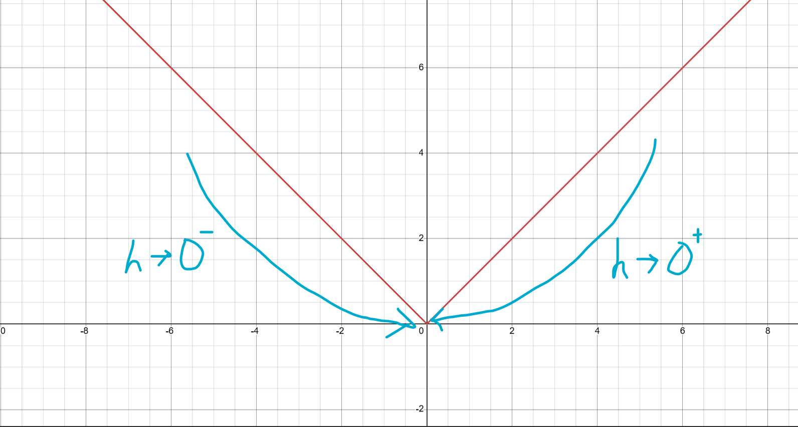

# Chapter 4.4: Advanced L1 Lasso Optimization
In this chapter, we'll be covering about:
1. Non-Differentiability in L1 Lasso Regularization
2. Karush-Kuhn-Tucker (KKT) Conditions in L1 Lasso Regularization
3. Examples on updating our weights using coordinate descent in L1 Lasso Regularization

# a) Non-differentiability in L1 Lasso Regularization
- Recap from `Chapter 1.2: Advanced Linear Regression Topics`, the absolute function is a type of convex function where it is not differentiable everywhere, as it is non-differentiable at 0.
- This is due to the **unequal limit approximation** from `left-hand-side(LHS)` and `right-hand-side (RHS)` when calculating the **derivative** of absolute function using **limit definition**, which is shown as below:

**Let:** f(x)=|x|
- Recall the limit definition of derivative:
$$\lim_{h \to 0}\frac{f(x+h)-f(x)}{h}$$
- Since we're proving that the derivative of the absolute function is non-differentiable at x=0, we will be using the limit definition of derivative to prove it by setting x as 0: 
**Derivative of absolute function from LHS**:
$$
\begin{aligned}
& \lim_{h \to 0^-}\frac{f(x+h)-f(x)}{h}\\
& =\lim_{h \to 0^-}\frac{|x+h|-|x|}{h}\\
& =\lim_{h \to 0^-}\frac{|0+h|-|0|}{h}\\
& =\lim_{h \to 0^-}\frac{|h|}{h}\\
& =\frac{|-0.0001|}{-0.0001}\\
& = -1
\end{aligned}
$$
**Where:**\
$\lim_{h \to 0^-}\frac{f(x+h)-f(x)}{h}$: Limit definition of a function's derivative\
$h\to0^-$: h value is approaching towards 0 from the left hand side, which is negative values
- In this case, since h is approaching towards 0 from the left hand side, this means that the h value will be approximately close to negative value (i.e.: -0.0001).

**Derivative of absolute function from RHS**: 
$$
\begin{aligned}
& \lim_{h \to 0^+}\frac{f(x+h)-f(x)}{h}\\
& =\lim_{h \to 0^+}\frac{|x+h|-|x|}{h}\\
& =\lim_{h \to 0^+}\frac{|0+h|-|0|}{h}\\
& =\lim_{h \to 0^+}\frac{|h|}{h}\\
& =\frac{|0.0001|}{0.0001}\\
& = 1
\end{aligned}
$$
**Where:**\
$\lim_{h \to 0^-}\frac{f(x+h)-f(x)}{h}$: Limit definition of a function's derivative\
$h\to0^+$: h value is approaching towards 0 from the right hand side, which is positive values
- In this scenario, since h is approaching towards 0 from the right hand side, this means that the h value will be approximately close to positive value (i.e.: 0.0001).

You may visualize the limit of h approaching from both LHS and RHS based on the graph image below:

- Based on the graph drawing, you can see when h is approaching from left hand side, aka $h\to 0^-$, the value shrinks down from negative value approximately to 0. (i.e.: from $-5 \to -1 \to -0.0001 \to 0$)
- On the other hand, when h is approaching from right hand side, aka $h \to 0^+$, the value shrinks down from positive value approximately to 0. (i.e.: from $5 \to 1 \to 0.0001 \to 0$)

**Since $-1\neq 1$, the value of limit from LHS is not the same from RHS. Thus, the limit doesn't exist and the absolute function is non-differentiable at 0.**
- As a result, we use sub-gradient, ${\partial }(|\theta|)$ to represent the derivative of convex function that is non-differentiable everywhere. 
- This is shown as below:
$$
\begin{aligned}
& \frac{\partial }{\partial \theta_{j}}(\lambda\sum_{i=1}^{m}|\theta_{i}|)\\
&= \lambda\cdot  \begin{cases} -1& \text{if } \theta_{j} < 0 \\ {[-1, 1]} & \text{if } \theta_{j} = 0 \\ 1& \text{if } \theta_{j}> 0 \end{cases}\\
&= \lambda\cdot \text{sign}(\theta_{j}), \text{sign}(0)\in [-1, 1]\\
\text{Alternative:}\\
& = \lambda{\partial }(|\theta_j|)
\end{aligned}
$$
- Furthermore, when the absolute value of the weight, $|\theta|$ = 0, the result is [-1, 1] interval. This means that the derivative of the absolute value of weights accepts any value as long as it is within the interval.
- In many practical use case, many use the sign() function to represent the sub-gradient/piecewise function, where $\partial \theta$ is -1 when $\theta$ is negative value, 1 when $\theta$ is positive value and 0 when $\theta$ is 0.
- You could see that it is arguable where ${\partial }{|\theta|}=0$ when $|\theta|=0$, and while in most cases this is true, it goes more complicated than that, which will be explained later.

# Karush-Kuhn-Tucker (KKT) Conditions in Lasso L1 Regularization
- Thus, the KKT condition for Lasso Regression, it is as below:

**If $\theta_j \ne 0$:**
$$
\frac{1}{n}x^T_j(y-X\theta) = \lambda\cdot sign(\theta_j)
$$

**If $\theta_j = 0$:**
$$
\begin{aligned}
& \frac{1}{n}x^T_j(y-X\theta) = \lambda\cdot sign(\theta_j)\\
& \frac{1}{n}x^T_j(y-X\theta) \in \lambda\cdot [-1, 1]\\
& \frac{1}{n}x^T_j(y-X\theta) \in [-\lambda, \lambda]\\
\end{aligned}
$$
**Where:**\
$\frac{1}{n}x^T_j(y-X\theta)$: Gradient of the MSE loss function ($\frac{1}{2n}\sum_{i=1}^{n}(y_{i}-\hat{y_{i}})^{2}$)\
sign($\theta_j$) = -1 when $\theta_j < 0$\
sign($\theta_j$) = 1 when $\theta_j > 0$\
sign($\theta_j$) $\in$ [-1, 1] when $\theta_j = 0$
- For the above formula, we have used **sign($\theta_j$) $\in$ [-1, 1] when $\theta_j = 0$**. Thus, the sign($\theta_j$) is converted into [-1. 1] and = becomes $\in$.

**This is equivalent to:**
$$
|\frac{1}{n}x^T_j(y-X\theta)| \le \lambda
$$
- For $\theta_j$ = 0, it needs to satisfy the condition, which is $|\frac{1}{n}x^T_j(y-X\theta)| \le \lambda$.
- In short, this helps to choose the value of the sub-gradient at non-differentiable $\theta=0$ to ensure that the Lasso is at the most optimum solution.

# L1 Lasso Regularisation Example with Coordinate Descent:
Let's assume a dummy dataset to be consisting of 2 features: $x_1$, and $x_2$.\
$$y=2x_1+0x_2+\epsilon, \lambda=0.3$$
$$
X=
\begin{pmatrix}
1 & 1 \\
-1 & 1 \\ 
\end{pmatrix},
y=
\begin{pmatrix}
2\\
-2
\end{pmatrix},
$$

$$
x_1=
\begin{pmatrix}
1\\
-1
\end{pmatrix},
x_2=
\begin{pmatrix}
1\\
1
\end{pmatrix}
$$

- **Additional Notes:** The 2 in $2x_1$ stands for the weight for feature $x_1$, which explains how the data is generated: For example:
$$
2x_1 = 2\cdot \begin{pmatrix}1\\-1\end{pmatrix} = \begin{pmatrix}2\\-2\end{pmatrix} = y
$$
- In practical use case, $\lambda$ is always set to a very small value, like 0.0001, and it is set by validation like cross-validation or k-fold validation which will be explained later on. For the example sake we'll tune it a little bit higher to see the effects of weights penalty more clearly

**L1 Penalty:**\
**Feature 1, $x_1$**: Test whether $\theta_1=0$ is valid\
**Thus,**

**Let: $\theta_1$ = 0**,
$$
\begin{aligned}
& \frac{1}{n}|x^T_1(y-X\theta)| =\frac{1}{n}|x^T_1(y-(x_1\theta_1+x_2\theta_2))|\\
& \frac{1}{n}|x^T_1(y-X\theta)| =\frac{1}{n}|x^T_1[y-(x_1\cdot0+x_2\cdot0)]|\\
& \frac{1}{n}|x^T_1(y-X\theta)| =\frac{1}{n}|x^T_1(y)|\\
&= \frac{1}{2}|\begin{pmatrix}1&-1\end{pmatrix}\begin{pmatrix}2\\-2\end{pmatrix}|\\
&= \frac{1}{2}|(2+2)|\\
&= 2 \\
& \ge \lambda
\end{aligned}
$$
**Additional Note:** The reason why $\theta_2=0$ in the above scenario is due to the regression formula earlier:
$$y=2x_1+0x_2+\epsilon$$
Where the data output does not depend on the 2nd feature, $\theta_2$.

**Since $|\frac{1}{n}x^T_1(y-X\theta)|\ge\lambda$, $\theta_1=0$ is not valid as it doesn't satisfy KKT conditions. Thus:**,\
$$
\frac{1}{n}x^T_j(y-X\theta) = \lambda\cdot sign(\theta_j), \theta_j\ne0
$$

$$
\begin{aligned}
& \frac{1}{n}x^T_1(y-X\theta)=\frac{1}{n}x^T_1(y-x_1\theta_1)\\
&= \frac{1}{n}x^T_1y - \theta_1\frac{1}{n}x^T_1x_1\\
&= \frac{1}{2}\begin{pmatrix}1&-1\end{pmatrix}\begin{pmatrix}2\\-2\end{pmatrix} - \theta_1\frac{1}{2}\begin{pmatrix}1&-1\end{pmatrix}\begin{pmatrix}1\\-1\end{pmatrix}\\
&= 2-\theta_1
\end{aligned}
$$

**Additional Notes:** The reason we do not substitute $\theta_1=2$ into the $2-\theta_1$ is that 2 is the OLS weights, not the Lasso penalized weights. So we will set $\theta_1$ as a variable for now

**Since $\theta_1\ge0$, $sign(\theta_1) = 1$**\
$$
\begin{aligned}
& \frac{1}{n}x^T_1(y-X\theta) = \lambda\cdot sign(\theta_1)\\
& 2-\theta_1 = \lambda \cdot 1\\
& 2-\theta_1 = \lambda\\
& \theta_1=2-\lambda
\end{aligned}
$$
**Additionally, in order to ensure that $\theta_1$ is always $\ge0$, we need to ensure that $2-\lambda \ge 0, \lambda\le2$. Thus, we can apply max function to the weights interval:**
$$
\theta_1 = max(2-\lambda, 0)
$$

**Finally,** by substituting $\lambda=0.3$ from our formula earlier into the $\theta_1$:
$$
\theta_1 = 2-0.3 = 1.7
$$

- In the end, you can see that L1 Lasso Regularization has successfully shrunk the value of the weights, $\theta_1$ to reduce overfitting. However since $\theta_1$ is still relevant to the y output, it will not be set to exactly 0.

****
**Feature 2, $x_2$**: Test whether $\theta_2=0$ is valid

**Let $\theta_2=0$,**\
$$
\begin{aligned}
& \frac{1}{n}|x^T_2(y-X\theta)| = \frac{1}{n}|x^T_2(y-(x_1\theta_1+x_2\theta_2))|\\
&= \frac{1}{n}|x^T_2(y-(x_1\theta_1+x_2\cdot 0))|\\
&= \frac{1}{n}|x^T_2(y-x_1\theta_1)|\\
&= \frac{1}{n}|x^T_2y-\frac{1}{n}x^T_2x_1\theta_1|\\
&= \frac{1}{2}|\begin{pmatrix}1&1\end{pmatrix}\begin{pmatrix}2\\-2\end{pmatrix}-\theta_1\frac{1}{2}\begin{pmatrix}1&1\end{pmatrix}\begin{pmatrix}1\\-1\end{pmatrix}|\\
&= \frac{1}{2}|\begin{pmatrix}1&1\end{pmatrix}\begin{pmatrix}2\\-2\end{pmatrix}-\theta_1\cdot0|\\
&= \frac{1}{2}|(2-2)|\\
&= 0 \\
& \le \lambda
\end{aligned}
$$
**Additional Notes:** Interestingly, in the above test we can set $y-X\theta=y$, however, that is strictly because our column matrix X is orthogonal, where $x^T_2x_1=0$. Thus, together with $\theta_2=0$, it simplifies everything down to $y-X\theta = y$.

**Since $|\frac{1}{n}x^T_2(y-X\theta)|\le\lambda$, $\theta_2=0$ is valid as it satisfied KKT conditions. Thus:**,
$$
\lambda(|\theta_1|+|\theta_2|) = \lambda(|\theta_1|)
$$

- Since our 2nd feature, $x_2$ is just a noise, where its weight is 0. L1 penalty successfully remove the 2nd feature which is irrelevant, and keep only the 1st feature, $x_1$.

# Reference:
1. The Lasso Lecture Notes (BIOS 7240 University of Iowa): https://myweb.uiowa.edu/pbreheny/7240/s21/notes/2-17.pdf
2. Tutorial on Lasso (Statistics Student Seminar @ MSU): https://www.stt.msu.edu/users/wangho16/lasso.pdf
3. CMU KKT Conditions Notes (Convex Optimization 10-725): https://www.stat.cmu.edu/~ryantibs/convexopt-F13/lectures/13-kkt.pdf
4. CMU Coordinate Descent Notes (Convex Optimization 10-725): https://www.stat.cmu.edu/~ryantibs/convexopt-F18/lectures/coord-desc.pdf
