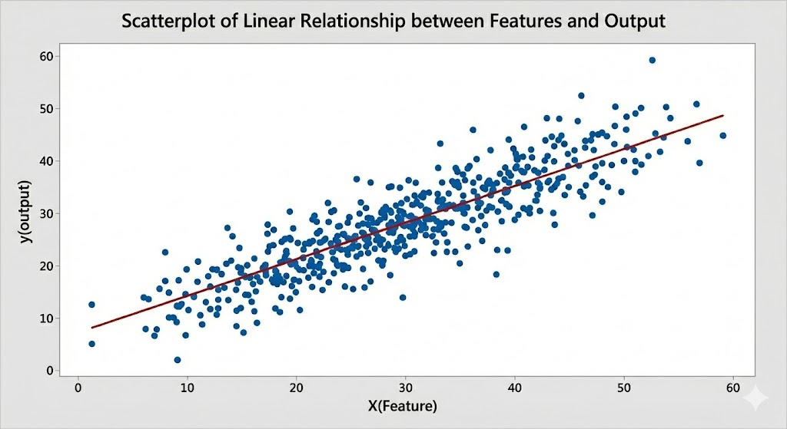
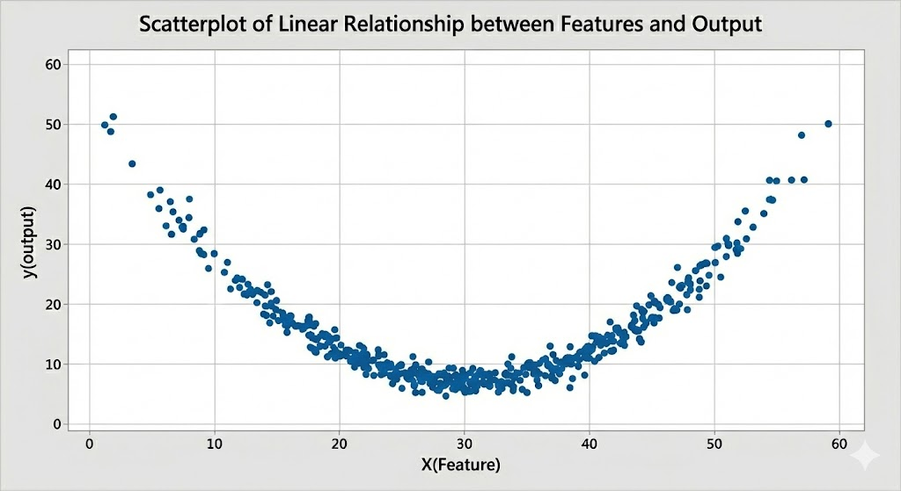
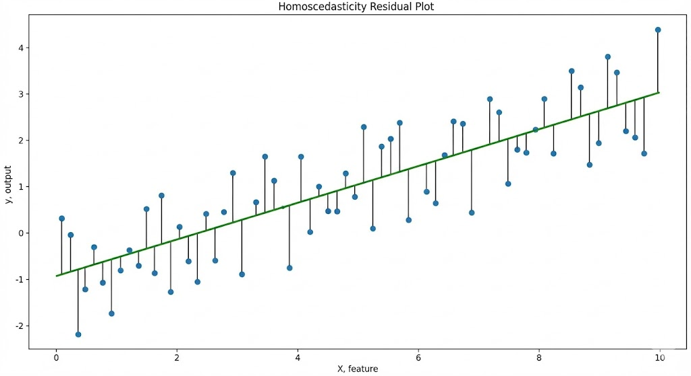
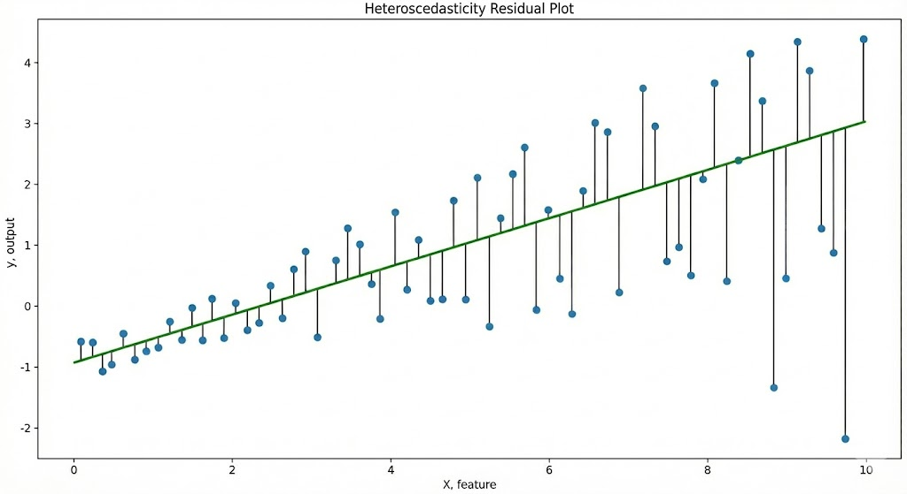

# Chapter 1.2: Assumptions in Linear Regression 
In this chapter, we will be learning about:
1. The 4 main assumptions of Linear Regression

# Assumptions in Linear Regression
Before we move towards any advanced topics like `multicollinearity`, `regularization methods`, `Maximum Likelihood Estimation (MLE)` of regression models and more, we need to understand the assumptions that are made in Linear Regression.
1. `Linearity`: The relationship between the features, X and the output, y should be linear, which is a straight line and not a hyperbola
2. `Homoscedasticity of Residuals`: Homoscedasticity refers to the variance of the residuals is constant at all levels.
3. `Independence and identically distributed (IID)`: In this case, the error term of Linear Regression mentioned earlier are not correlated based on the outcome, and it should be a normal distribution (equal mean and variance) 
4. `No Multicollinearity`: The features in Linear Regression must not be highly correlated with each other

Do not worry when you're confused reading it, it is the same for me at first as well. We will break it down 1 by 1 in detail, along with introducing some advanced topics that are relevant to it.

# a) Linearity
The first assumption states that the relationship between the features X, and the output, y should be in a straight line linearly.

This is because only in a **linear relationship** between the variables and the output can we draw the **best fit line**. If the relationship between X and y is not linear, say a curve or a hyperbola, it is impossible to draw a best fit line, as illustrated below:\

As you can see in the **first image**, the data between the Features and the Output are scattered in a linear relationship. Thus, we are able to plot the best fit line across the data.

However, in the **second image**, the data between the Features and the Output are scatterd in a non-linear relationship. As a result, we are unable to draw a line that best fit the dataset.

**How to overcome non-linearity if it is violated:**
1. `Use non-linear regression models`: Non-linear regression models like `polynomial regression` are the best choice when dealing with non-linear relationship between features and output. This is because it uses polynomial terms like $x^2$ and $x^3$, which allows the best fit line to bend and fit the non-linear dataset. We will cover it in detail in future topics

# b) Homoscedasticity of Residuals
The second assumption states that the variance of the residuals should be constant and not increasing across all level.

- In simple words, this means that the variance of the residuals(error) in the Linear Regression model, $\epsilon$, should be spread equally across the data in a uniform manner. 

You may have seen the error term in Linear Regression formula, as it represents in simple words the difference between `predicted output`, $\hat{y}$ and `actual output`, y. As illustrated below:\

- **First Graph (Homoscedasticity)**: The residuals(error) are spread evenly at all levels. This means that the difference between `predicted output` and the `actual output` is similar even when the `output`, y value increases. This results in a constant variance.
- **Second Graph (Homoscedasticity)**: The residuals(error) are spread unevenly at all levels. This means that the difference between `predicted output` and the `actual output` is increasing along with the `output`, y value. This results in a increasing variance.

**Example of homoscedasticity and heteroscedasticity with House Price Prediction**:
- `Homoscedasticity`: The difference in value(`residual`) between the predicted value and the actual value of house prices at **\$200000** is **equal** to the `residuals` between the predicted value and the actual value at **\$1000000**.\
This means that the **variance** of the residuals is **constant** across all house prices, as their difference is constant across all house prices

- `Heteroscedasticity`: The residual between the predicted value and the actual value of house prices at **\$200000** is lower than the `residuals` between the predicted value and the actual value at **\$1000000**.\
This means that the **variance** of the residuals is **lower** across all house prices, as their difference is constant across all house prices

**Additional Notes:**
- The assumption of homoscedasticity where variance is constant in linear regression is crucial as it will be carried towards the `third assumption`, **Independent and Identically Distributed (IID)**
- The data points **above** the best fit line(`predicted output`) represents **positive residuals**, while the data points **below** the best fit line represents **negative residuals**.

# c) Independent and Identically Distributed (IID)
The third assumption states that the error term(residuals), $\epsilon$, in Linear Regression model should not have any correlation with the output and distributed normally.
- Let's break this into 2 parts, `independent` and `identically distributed`

**i. Independent**
- This means that the error term in the model should not be a part of influencing the value of the output, and it should be standing on its own as a separated variable, hence the term `independent`.

**ii. Identically Distributed**
- This means that the error term(residual) follows a Normal Distribution, aka `Gaussian Distribution`. 
- Thus, the mean of the residuals is 0 and the variance is constant. (The constant variance is also contributed by the assumption of homoscedasticity)

**Additional Notes:**
- Based on `Central Limit Theorem (CLT)`, if you take a sufficient large number of IID variables and sum them together, the distribution of the sum will approach `Normal(Gaussian) Distribution`
- The value of mean being zero can be also traced back with the **positive residuals** and **negative residuals** earlier in the `Homoscedasticity Assumption`, where both side values are equal, which results in them negating each other and results in a 0 value.
- The `IID Assumption` is crucial as it will be carried on later with `Maximum Likelihood Estimation` of Linear Regression by deriving it into the `Mean Square Error` using Gaussian Distribution, which plays a part in `Generalized Linear Models`

# d) No Multicollinearity
The forth assumption states that the features in Linear Regression should not have high correlation with each other.
- Multicollinearity refers to variables(`features`) that are closely related with each other, causing a high correlation
- This is bad in Linear Regression because of a few things:
  1. It makes it hard for the model to access the true contribution of each coefficient(feature), as they are closely related which makes it hard for separating them
  2. High collinearity will inflate the coefficient variance, resulting in coefficient explosion
- In `Chapter 1.3: Multicollinearity in Ordinary Least Squares`, we will be proving in depth about why multicollinearity causes covariance explosion due to ill-conditioned matrix which results in numerical instability, and how Ridge Regularization solves this problem

# Further Reading:
- `Chapter 1.3: Multicollinearity in Ordinary Least Squares`
- `Chapter 4: Regularization Techniques in Machine Learning`

# Reference: