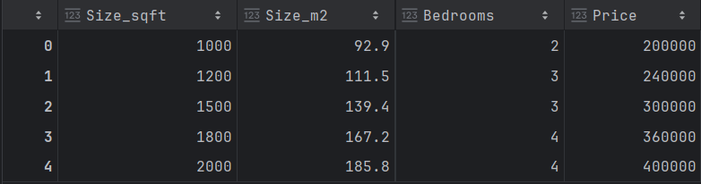
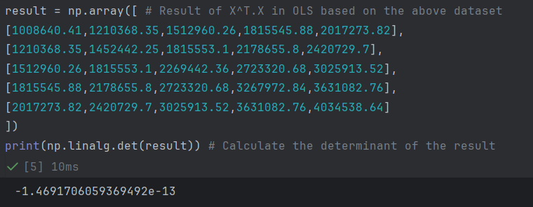
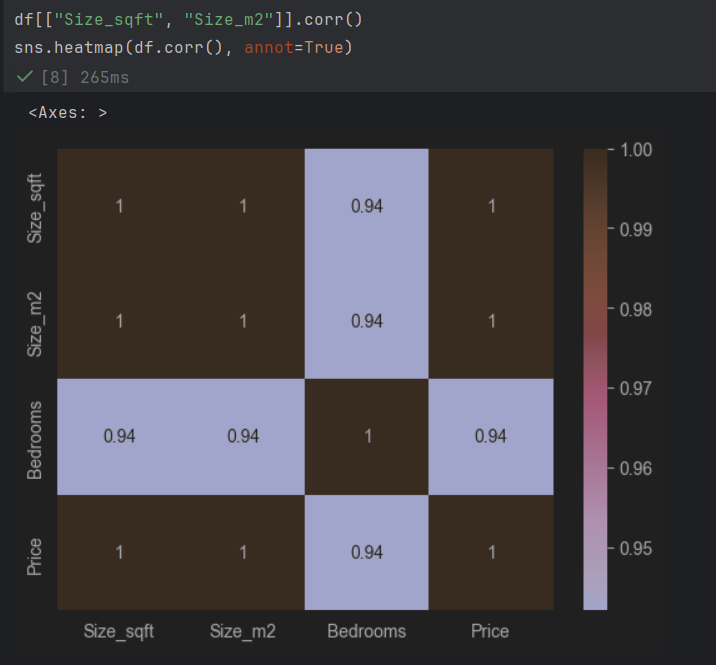
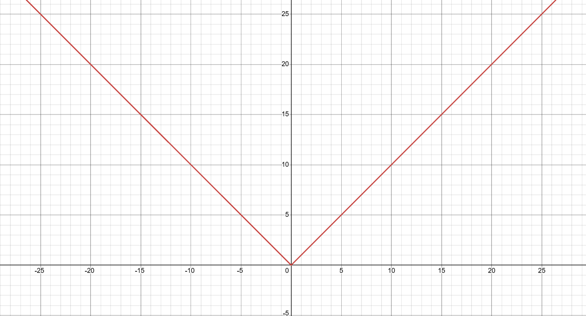

# Chapter 1.3: Multicollinearity in Ordinary Least Squares
- In `Chapter 1.2: Assumptions in Linear Regression`, we have explained why the existence of multicollinearity in a dataset is bad as the high correlation between features cause the model unable to separate their impact towards the target.
- Furthermore, multicollinearity will cause the inverse matrix in OLS to be ill-conditioned and numerically unstable, which will be explained later.
- Thus, the goal of this chapter is to:
1. Prove why multicollinearity causes numerical instability in OLS inverse matrix
2. How to detect multicollinearity in your dataset
3. How to resolve multicollinearity issue using regularization techniques

**Mathematical Proof of multicollinearity leading to X^T.X being singular matrix**
- In short, this is the mathematical proving as to why highly collinear features will result in coefficient variance explode, especially in `Ordinary Least Squares (OLS)` formula
- Recap: The OLS formula is as below:
```math
\theta = (X^TX)^{-1}X^Ty
```
**Where:**
1. X: Features Matrix
2. $X^T$: Transpose of X
3. y: Output matrix
- In Multicollinearity, if we have a feature that is dependent on another feature, it will lead to the $(X^TX)$ in `OLS` to be a singular matrix, where it is non-invertible.
- This can be proved using the below example:


- In this dataset, the feature `size_sqft`(size measured in square feet) and `size_m2`(size measure in square meter) are highly correlated with each other, as `size_sqft` = `size_m2` * 0.092903.
- As we try to calculate $X^TX$ in OLS based on this dataset, it will be as below:
```math
\begin{bmatrix}
1 & 1000 & 92.9 & 3 \\
1 & 1200 & 111.5 & 3 \\
1 & 1500 & 139.4 & 3 \\
1 & 1800 & 167.2 & 4 \\
1 & 2000 & 185.8 & 4
\end{bmatrix}
\begin{bmatrix}
1 & 1 & 1 & 1 & 1 \\
1000 & 1200 & 1500 & 1800 & 2000\\
92.9 & 111.5 & 139.4 & 167.2 & 185.8\\
3 & 3 & 3 & 4 & 4\\
\end{bmatrix}
= 
\begin{pmatrix}
1008640.41 & 1210368.35 & 1512960.26 & 1815545.88 & 2017273.82\\
1210368.35 & 1452442.25 & 1815553.1 & 2178655.8 & 2420729.7\\
1512960.26 & 1815553.1 & 2269442.36 & 2723320.68 & 3025913.52\\
1815545.88 & 2178655.8 & 2723320.68 & 3267972.84 & 3631082.76\\
2017273.82 & 2420729.7 & 3025913.52 & 3631082.76 & 4034538.64
\end{pmatrix}
```
**Where 1 represent the bias of the dataset**
- When we try to inverse the results by finding the determinant:\

- We calculated that the determinant of the results of $X^TX$ in OLS is `-1.46917e-13`, which is very close to 0.
- As a result, this leads to our $(X^TX)^{-1}$ to be numerically unstable, as when our determinant becomes smaller, the inverse will inflate and explode.
- Thus, this proves our theory above where when we have features that are highly correlated with each other, which causes the $(X^TX)$ determinant close to 0, making it a singular matrix and non-invertible.

**Explanation on coefficient variance explosion in Multicollinearity**
- Below is the formula of coefficient variance:
```math
\text{var}(\theta)=\sigma^{2}\cdot(X^TX)^{-1}
```
**Where:**\
var($\theta$): Coefficient Variance
$\sigma^2$ = error(residual) variance 
- Since we have concluded that when the **features are highly correlated**, the `determinant`, det($X^TX$) will become closer to 0, leading to $(X^TX)^{-1}$ to become closer to ∞, as $(X^TX)^{-1}$ = $\frac{1}{det(X^TX)}\cdot\text{Adj}(X^TX)$
- As a result, this cause our coefficient variance to inflate or explode due to the unstable $(X^TX)^{-1}$

**To be more technical sounding, this scenario is known as ill-conditioned $(X^TX)^{-1}$, where the unstable inverse matrix is approaching ∞ due to its small eigenvalues causing the determinant to approach 0, resulting in exploding coefficient variance**

**Coefficient variance explosion in Multicollinearity using eigenvalue intuition**
- We can also determine if $X^TX$ is a singular matrix which leads to coefficient variance explosion using eigenvalue
- In a square matrix, the dimension of the square matrix is equal to the number of eigenvalues.
- For example, in a 2x2 matrix, the number of eigenvalues is 2. As shown below:
```math
\begin{aligned}
&\text{det}(\begin{pmatrix}
1 & 4 \\
3 & 2 \\ 
\end{pmatrix}
-\lambda\begin{pmatrix}
1 & 0 \\
0 & 1 \\ 
\end{pmatrix})\\
&=\text{det}
\begin{pmatrix}
1-\lambda & 4 \\
3 & 2-\lambda \\ 
\end{pmatrix}\\
&=(1-\lambda)(2-\lambda)-12\\
&=\lambda^2-3\lambda-10\\
&=(\lambda-5)(\lambda+2)\\
&\lambda_1=5, \lambda_2=-2
\end{aligned}
```
- Furthermore, the determinant of a square matrix can be calculated by multiplying the eigenvalues together. For example:
```math
\text{det}\begin{pmatrix}
1 & 4 \\
3 & 2 \\ 
\end{pmatrix}\\
=(1*2)-(3*4)=-10
```
```math
\text{det}\begin{pmatrix}
1 & 4 \\
3 & 2 \\ 
\end{pmatrix}\\=\lambda_1*\lambda_2=5*(-2)=-10
```
- Take in note that this explains square matrix multiplication using eigenvalues in general. In $X^TX$ scenario, the eigenvalues are always positive.
- Thus, we can generalise the formula for calculating the determinant of a square matrix with `p` number of eigenvalues as:
```math
\text{det}(X^TX)=\prod_{i=1}^{p}(\lambda_i)
```
Where:\
$X^TX$: Square matrix\
$\prod_{i=1}{p}$: The product of all eigenvalues in a square matrix from i to p, $\lambda_1*\lambda_2*\lambda_3*...*\lambda_p$\
$\lambda_i$: The ith value of the eigenvalue in a square matrix

**Disclaimer:** The generalised formula only works on square matrix, where its dimension is `n x n`. If you use non-square matrix, the results will not be the same due to unequal dimensions on row and column. Since our $X^TX$ forms a square matrix, it is valid to use this formula.

- Now in multicollinearity, the highly correlated features causes the eigenvalues to be of small value, which cause the determinant to shrink towards 0, approaching extremely large inverse matrix or singularity matrix. 
- Furthermore, the small eigenvalue values in $X^TX$ will lead to the eigenvalues of the inverse matrix, $(X^TX)^{-1}$ to be extremely large, as the eigenvalue of inverse matrix is the reciprocal of the eigenvalue of original matrix. This can be visualized as below:
```math
\text{Eigenvalue}(X^TX) = \lambda_1, \lambda_2, \lambda_3,...,\lambda_p
```
```math
\text{Eigenvalue}(X^TX)^{-1}= \frac{1}{\lambda_1}, \frac{1}{\lambda_2}, \frac{1}{\lambda_3},...,\frac{1}{\lambda_p}
```
**Thus,**
- $\lambda_i$ of $X^TX$ -> 0
- $\lambda_i$ of $(X^TX)^{-1}$ -> $\frac{1}{0}$ -> ∞
- As a result, due to small eigenvalues, which leads to large inverse eigenvalues value, causing unstable $(X^TX)^{-1}$ and coefficient variance explosion.

# How to detect multicollinearity in dataset
1. Correlation matrix with heatmap:
- You can use heatmap from `seaborn` library to visualize the correlation matrix between features in a dataset.
- Correlation matrix > 0.7: Multicollinearity presence
- You may refer to the heatmap diagram below based on the above dataset:

- `Heatmap Correlation Matrix`: Around `0.94 - 1`, which is considered extremely high and explain why the exploding covariance.

2. Variance Inference Factor (VIF)
- It helps detects multicollinearity by calculating how much the variance of a coefficient is increased due to its correlation with other coefficients
- Its formula is as below:
```math
\text{VIF} = \frac{1}{1-R^2}
```
**Where:**\
$R^2$: r-squared value
- `Low VIF value`(i.e. 1): Minimal multicollinearity, 
- `High VIF values`(i.e. 5 or 10 above): High multicollinearity

# How to resolve multicollinearity issue
1. `Variable Removal`: The simplest way is to remove the feature that is causing the multicollinearity. For our example we can remove `Size_m2` as it is correlated to `Size_sqft`
2. `Feature Engineering`: Combining 2 correlated features together into a new feature which are less correlated with each other
3. `Regularisation`: L1 Lasso and L2 Ridge are effective in controlling coefficient variance due to the addition of penalty, which helps forces some coefficient values to be 0, and reducing sensitivity to multicollinearity
4. `Principal Component Analysis (PCA)`: It is a part of unsupervised machine learning concepts that will be covered in future topics

**Additional Notes: How L1 Lasso and L2 Ridge regularisation solve multicollinearity**\

In L1 Lasso and L2 Ridge, they add a penalty constant inside $(X^TX)$ in OLS, which prevents the determinant from going to zero.\
`L2 Ridge Penalty OLS Derivation`:\
**Let:**
```math
z=(y-X\theta)
```
**Then:**
```math
\begin{aligned}
& J(\theta)= \frac{1}{2n}z^Tz+\frac{\lambda}{2}\theta^2\\
& =\frac{1}{2n}(y-X\theta)^T(y-X\theta)+\frac{\lambda}{2}\theta^T\theta\\
& \approx\frac{1}{2n}\sum_{i=1}^{n}(y_i-\hat{y_i})^{2}+\frac{\lambda}{2}\sum_{j=1}^{n}\theta_j^2, \hat{y}=X\theta\\
\end{aligned}
```
**Thus,**
```math
\begin{aligned}
& \frac{\partial J(\theta)}{\partial \theta} =\frac{\partial }{\partial \theta}(\frac{1}{2n}(y-X\theta)^T(y-X\theta)+\frac{\lambda}{2}\theta^T\theta)\\
& = \frac{\partial }{\partial \theta}(\frac{1}{2n}(y-X\theta)^T(y-X\theta)) + \frac{\partial }{\partial \theta}(\frac{\lambda}{2}\theta^T\theta)\\
& = \frac{1}{2n}\frac{\partial }{\partial \theta}((X\theta)^TX\theta-(X\theta)^Ty-y^T(X\theta)+y^Ty)+\frac{\lambda}{2}\cdot2\theta\\
& = \frac{1}{2n}\frac{\partial }{\partial \theta}(\theta^T(X^TX)\theta-y^T(X\theta)-y^T(X\theta)+y^Ty)+\lambda\theta\\
& = \frac{1}{2n}\frac{\partial }{\partial \theta}(\theta^T(X^TX)\theta-2y^T(X\theta)+y^Ty)+\lambda\theta\\
& = \frac{1}{2n}(2X^TX\theta-2X^Ty)+\lambda\theta\\
& = \frac{1}{n}(X^TX\theta-X^Ty)+\lambda\theta\\
&\text{Alternatively},\\
& = -\frac{1}{n}(X^Ty-X^TX\theta)+\lambda\theta\\
& = -\frac{1}{n}X^T(y-X\theta)+\lambda\theta
\end{aligned}
```
**Where:**
1. X: Features Matrix
2. $X^T$: Transpose of X
3. y: Output matrix
4. $\theta$: Weights of features

- In step 5. we used the rule $\frac{\partial }{\partial \theta}(\theta^TA\theta)=2A\theta$ for A is a symmetrical matrix, thus $\frac{\partial }{\partial \theta}(\theta^T(X^TX)\theta)=2X^TX\theta$

**Now if we make the derivative of the cost function MSE, $J(\theta)$=0, we will get:**
```math
\begin{aligned}
& -\frac{1}{n}X^T(y-X\theta)+\lambda\theta=0\\
& (X^Ty-X^TX\theta)-n\lambda\theta=0\\
& -(X^TX+n\lambda I)\theta+X^Ty = 0\\
& (X^TX+n\lambda I)\theta=X^Ty
\end{aligned}
```
**Then when we convert this into a closed solution to minimize the weights, $\theta$ by throwing everything to the right hand side:**
```math
\begin{aligned}
& (X^TX+n\lambda I)\theta=X^Ty\\
& \theta=(X^TX+n\lambda I)^{-1}X^Ty
\end{aligned}
```

- When you compare the original OLS with Ridge-OLS, you'll see the additional $\lambda I$ which is the penalty. The I is just identity matrix so no need to worry about that.
- The addition of $\lambda I$ penalty into the original $(X^TX)$ helps to prevent its determinant from becoming too small and approaching 0.
- To further explain, the $\lambda I$ penalty help increases the value of $X^TX$. Thus, the eigenvalues of $(X^TX+\lambda I)$ will become larger, which in turn causes the eigenvalues of the inverse $(X^TX+\lambda I)^{-1}$ to become smaller, causing the inverse matrix's value to be more stable. To Visualize it:

**Before penalty is added $(X^TX)$:**
```math
\text{Eigenvalue}(X^TX) = 1, 2, 0.01, 3, 0.001
```
```math
\text{Inverse Eigenvalue}(X^TX)^{-1}= \frac{1}{1}, \frac{1}{2}, \frac{1}{0.01},\frac{1}{3},\frac{1}{0.001} \approx 1, 0.5, 100, 0.334, 1000, \text{ High Value!}
```

**After penalty is added $(X^TX + \lambda I)$, where $\lambda$ = 1, n=1**
```math
\text{Eigenvalue}(X^TX+n\lambda I) = 2, 3, 1.01, 4, 1.001
```
```math
\text{Inverse Eigenvalue}(X^TX+n\lambda I)^{-1}= \frac{1}{2}, \frac{1}{3}, \frac{1}{1.01}, \frac{1}{4}, \frac{1}{1.001} \approx 0.5, 0.334, 0.9901, 0.25, 0.999001, \text{ Low Value!}
```
- As you can see, before the penalty is added, small eigenvalue results in large inverse eigenvalue. However, after penalty is added, the eigenvalue increases, which results in a decrease in inverse eigenvalues.
- As a result, Ridge penalty helps stabilize the coefficient variance by preventing the eigenvalues of inverse matrix $(X^TX+\lambda I)^{-1}$ to be too large causing instability, which solves the problem of ill-conditioned $(X^TX)^{-1}$.

`L1 Lasso Penalty OLS Derivation`:\
**Disclaimer: While L1 is also acceptable to be used in OLS, L2 Ridge is most commonly used to solve multicollinearity issue for a few reasons. In the upcoming chapter, `Chapter 4: Regularisation Techniques in ML`, we will be comparing L1 and L2 in detail, and which is good at which scenario. As of now just know that L2 is mostly used in OLS than L1**\
**Let:**
```math
z=(y-X\theta)
```
**Then:**
```math
\begin{aligned}
& J(\theta)= \frac{1}{2n}z^Tz+\lambda|\theta|\\
& =\frac{1}{2n}(y-X\theta)^T(y-X\theta)+\lambda|\theta|\\
& =\frac{1}{2n}\sum_{i=1}^{n}(y-\hat{y_i})^{2}+\lambda\sum_{j=1}^{n}|\theta_j|, \hat{y}=X\theta\\
\end{aligned}
```
**Thus,**
```math
\begin{aligned}
& \frac{\partial J(\theta)}{\partial \theta} =\frac{\partial }{\partial \theta}(\frac{1}{2n}(y-X\theta)^T(y-X\theta)+\lambda||\theta||_1)\\
& = \frac{1}{2n}\frac{\partial }{\partial \theta}((X\theta)^TX\theta-(X\theta)^Ty-y^T(X\theta)+y^Ty)+\frac{\partial }{\partial \theta}(\lambda||\theta||_1)\\
& = \frac{1}{2n}\frac{\partial }{\partial \theta}(\theta^T(X^TX)\theta-y^T(X\theta)-y^T(X\theta)+y^Ty)+\frac{\partial }{\partial \theta}(\lambda||\theta||_1)\\
& = \frac{1}{2n}\frac{\partial }{\partial \theta}(\theta^T(X^TX)\theta-2y^T(X\theta)+y^Ty)+\frac{\partial }{\partial \theta}(\lambda||\theta||_1)\\
& = \frac{1}{2n}(2X^TX\theta-2X^Ty)+\lambda\cdot\begin{cases} -1& \text{if } \theta_{j} < 0 \\ {[-1, 1]} & \text{if } \theta_{j} = 0 \\ 1& \text{if } \theta_{j}> 0 \end{cases}\\
& = \frac{1}{n}(X^TX\theta-X^Ty)+\lambda\cdot\text{sign}(\theta), \text{sign(0)}\in[-1, 1]\\
& = -\frac{1}{n}X^T(y-X\theta)+\lambda\cdot\text{sign}(\theta), \text{sign(0)}\in[-1, 1]\\
\text{Alternative:}\\
& = -\frac{1}{n}X^T(y-X\theta)+\lambda\cdot{\partial }(||\theta||_1)
\end{aligned}
```
**Where:**
1. X: Features Matrix
2. $X^T$: Transpose of X
3. y: Output matrix
4. $||\theta||_1$: Weights of features in vector form
5. $\frac{\partial }{\partial \theta}(||\theta||)$: Subgradient with respect to weight

- In step 5. we used the rule $\frac{\partial }{\partial \theta}(\theta^TA\theta)=2A\theta$ for A is a symmetrical matrix, thus $\frac{\partial }{\partial \theta}(\theta^T(X^TX)\theta)=2X^TX\theta$

**Important Note**:
- In Lasso Regularization, we cannot directly take the derivative of theta w.r.t theta, $\frac{\partial }{\partial \theta}(||\theta||)$ to be 1.
- This is due to the formula in Lasso, where the penalty term is the product of regularization constant and sum of absolute values of weights, $\lambda\sum_{i=1}^{m}|\theta_{i}|$
- As a result, the absolute function of the weight, $\theta$ forms a convex function, which is shown as below:

- Based on the graph above, you can see that it is not differentiable at 0, and the reason behind it is due to limit approximation value not equal from left-hand-side and right-hand-side, but for the sake of simplicity this will be covered in a future chapter, `Chapter 4.2: Advanced topics in Regularization`.
- Thus, the derivative of absolute function will form a piecewise function, which is shown as below:
```math
\frac{1}{2n}(2X^TX\theta-2X^Ty)+\lambda\cdot\begin{cases} -1& \text{if } \theta_{j} < 0 \\ {[-1, 1]} & \text{if } \theta_{j} = 0 \\ 1& \text{if } \theta_{j}> 0 \end{cases}
```
- Based on this piecewise function, you can see that if the weight value is negative, its derivative will be -1, else if it is positive, the derivative will be 1.
- Interestingly, when the weight value is 0, mathematically its derivative(or referred as sub-gradient) is interval [-1, 1], as any value inside this range will be valid. This can be shown using the sign function as below: 
```math
=-\frac{1}{n}X^T(y-X\theta)+\lambda\cdot\text{sign}(\theta), \text{sign(0)}\in[-1, 1]
```
- Alternatively, in many academic/theoretical rigorous article instead of using sign() function, they use sub-gradient, which basically refers to the derivative of any convex function that are not differentiable everywhere, which is formed as below:
```math
-\frac{1}{n}X^T(y-X\theta)+\lambda\cdot\frac{\partial }{\partial \theta}(||\theta||_1)
```
- Both expressions are the same, where the sign function, sign($\theta$) and sub-gradient, $\frac{\partial }{\partial \theta}(||\theta||_1)$, both refers to the piecewise function above.
- While many libraries in Python like Numpy use sign() function where it transforms sign(0) = 0, it is not that accurate in practice especially optimizing the sub-gradient of Lasso at 0.
- This is because in optimizing Lasso sub-gradient $\frac{\partial }{\partial \theta}(||\theta||_1)$, when $\theta_j=0$, we need to specifically check if the gradient of the MSE loss function, specifically for the jth feature weight if it falls under the interval [$\lambda$, $\lambda$]. This is to follow the KKT conditions.
- If we blindly do sign(0) = 0, internally we do not really set the feature weight, $\theta_j$ to be exactly 0 in the MSE loss gradient, where it will just be close to 0 like 0.00001, -0.0000001 etc. More about this part will be explained in `Chapter 4.2: Advanced topics in Regularization`.
- Lastly, since we've mentioned that the derivative of absolute function is non-differentiable at 0, we cannot do the same trick of forming closed-solution for OLS like we did using vanilla OLS and L2 Ridge OLS. Thus, we cannot make L1 Lasso OLS equal to 0.
- Thus, the most optimal formula for the L1 Lasso OLS will be as below:
```math
-\frac{1}{n}X^T(y-X\theta)+\lambda\cdot\frac{\partial }{\partial \theta}(||\theta||_1)\in0
```

**While there are no closed form analytical solution in L1 Lasso with OLS, we can still solve it using optimization algorithms like `Least Angle Regression (LARS)`, `Coordinate Descent` and `Proximal Gradient Descent`, all which are too complex to cover in this topic**

# Multicollinearity Conclusion
In short, multicollinearity is caused due to high correlation between features in a dataset. This is significant as in OLS, it high correlation causes the $(X^TX)^{-1}$ matrix to be ill-conditioned, where the small eigenvalues lead to large inverse eigenvalues causing the inverse matrix to be unstable. This also causes coefficient variance explosion, as it is directly proportional with the inverse matrix. Thus, by using regularisation like L2 Ridge, it helps stabilize the inverse matrix by imposing penalty, which increase the value of the original $X^TX$, causing the inverse matrix to be smaller
