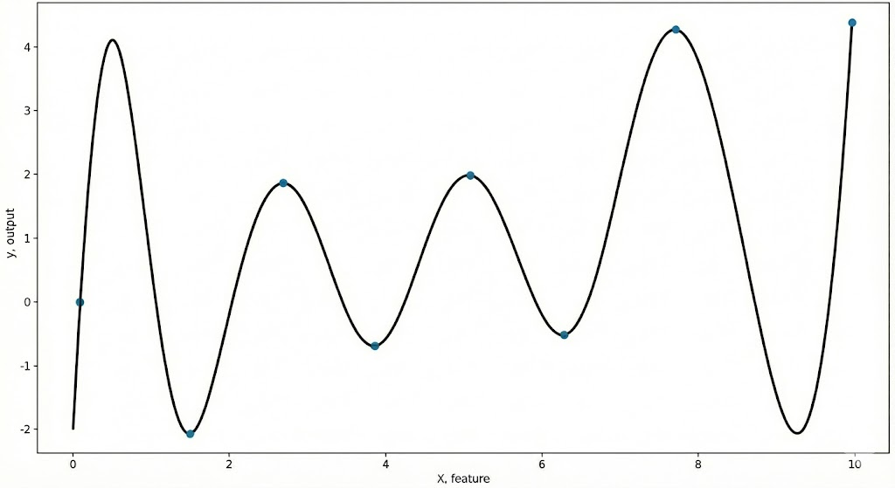
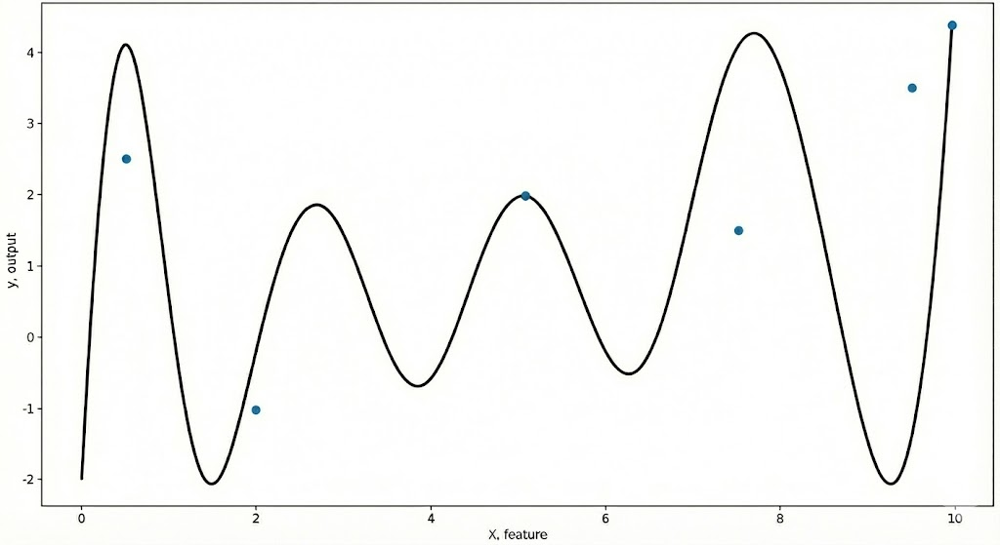

# Chapter 4.1: Introduction to Regularization techniques in Machine Learning
- In this chapter, we'll be covering on:
1. The motivation behind regularization in Machine Learning models
2. Intuition of L1 Lasso Regularization and sparsity
3. L1 Lasso Regularization formulas, gradient and how it is added into MSE to form Lasso Regression
4. L2 Ridge Regularization intuition, formulas, gradient and how it is added into MSE to form Ridge Regression
5. Elastic Net Regularization intuition, formulas, gradient and how it is mixed with MSE to form Elastic Net Regression
6. When to pick which regularization techniques to use

**Why we need regularization?**
- In machine learning, there is a essential topic which is known as **bias-variance tradeoff**. We will be covering that in the future chapter, `Chapter 6: Bias-Variance Tradeoffs and Decomposition`. 
- So in some machine learning models, they could be too sensitive to the noises in the dataset, where those noises can be random numbers that are irrelevant to the meaning of the dataset. This happens when dataset are not cleaned properly.
- As a result, when the models learn too much to an extent where they learn the noises as well, this forms a scenario where the variance is too high and the bias is too low.
- This is bad as when the model is learning the dataset in a too detailed manner, it hurts its ability to generalize well on other dataset.
- For example, the model might try to fit all 5 data in the dataset to achieve the best fit line, but in the other dataset that has completely different value it will not be able to predict it accurately, which is illustrated as below:


- In this first graph, you can see that the model learn too much in dataset 1 that it tries to fit all the points inside the dataset. As a result, in the second graph, you can see that the model couldn't generalize well in dataset 2 where it can only fit 2 data points out of the 6.
- This is known as overfitting in layman terms, and this problem is crucial as it is commonly seen during training and testing the model, where it learns all the patterns, including the noise in the training dataset, but it is not able to fit well in the testing dataset as its best fit line is tailored-made for the training dataset. This results in high training accuracy but low testing accuracy.
- Thus, the goal of regularization is to help balance the bias and variance in the model by reducing the variance in the model.

**Prerequisite Notes:**
- Coefficients: Weights of the features
- Coefficients Variance: The variability between the weights of the features. Refer to `Chapter 1.2: Advanced topics in Linear Regression`, when the features are highly correlated with each other, it causes numerical instability in OLS inverse matrix $(X^TX)^{-1}$ due to high eigenvalues, which result in exploding coefficient variance

In machine learning, there are 3 main regularization algorithms used to enhance the model performance:
1. `L1 Lasso Regularization (Lasso Regression)`
2. `L2 Ridge Regularization (Ridge Regression)`
3. `(L1 + L2) Elastic Net Regularization`

# a) L1 Lasso Regularization (Lasso Regression)
**Goal of L1 Lasso Regularization:**
- L1 Lasso Regularization helps reduce overfitting of model by encouraging some of the coefficients' value to be **exactly** zero. 
- As a result, it acts as feature selection which helps to filter out any irrelevant features that confuses the model and causes poor performance.
- This is why Lasso's main function is often known as `sparsity`, where it only selects the feature of the dataset that are important and remove the rest by setting their weight's value to 0.
- However, while Lasso is able to demonstrate sparsity by dropping out irrelevant features, it is not effective in shrinking the feature weights value unlike L2 Ridge. Thus, L1 Lasso might still struggle with multicollinearity due to its lack of effectiveness in smoothing the weights value, causing the highly correlated features to have high impact on numerical instability.

**What is Sparsity and its importance:**
- There are many types of sparsity, i.e.: 
1. `Data Sparsity`: When dataset has too many missing value)
2. `Activation Sparsity`: When many neurons are 'switched off' causing only a few to be active
3. `Model Sparsity`: When many model's parameters/features are turned to zero. 
- In this scenario we'll be focusing on Model Sparsity, as it is our main goal in reducing overfitting through Lasso Regularization.
- `Model Sparsity` refers to when a Machine Learning model has many features whose value are set to 0.
- This can be done by L1 Lasso Regularization, where its penalty causes the weights of features in a model to become exactly 0.

**The purpose of Sparsity:**
- Sparsity can be very efficient and important in many scenario, especially when the model is overfitting due to high complexity of features.
1. `Simplify the model complexity`: Through improving sparsity, it drops all the irrelevant features by making their weights as 0. This can help reduce overfitting.
2. `Improve Efficiency`: By reducing the dimensionality across multiple features, it reduces the computational cost of the model.
3. `Increased Explainability`: Through reducing the number of features in sparsity, it allows the model to focus on relevant features only. This further helps to understand the features significant through their coefficients.

# L1 Lasso Regularization Math Backbone
- In L1 Lasso Regularization, the formula is as below:

**Formula (Summation):**\
```math
\lambda\sum_{i=1}^{m}|\theta_{i}|
```
**Where:**\
$\lambda$ = Regularization penalty constant (recommended: 0.0001)\
m = Number of total columns (Total features in a dataset)\
$|\theta_{i}|$ = Absolute value of weights for each feature (from 1 - m)

**Formula (Matrix):**\
```math
\lambda||\theta||_1
```
**Where:**\
$\lambda$ = Regularization penalty constant (recommended: 0.0001)\
$||\theta||_1$ = L1 Norm of the absolute value of weights matrix (Shape: m, 1)

- In short, Lasso Regularization imposes a penalty which is the sum of the absolute values of all weights
- The goal of `L1 Lasso Regularization` is that it helps removes unnecessary features from the Machine Learning model. We will be explaining that in detail below
- By taking Linear Regression as a simple example, L1 Regularization is added into the loss function, `Mean Square Error` in the model.
- Additionally, the $\lambda$ here is the regularization hyperparameter constant. Hyperparameter simply refers to the constants/parameters that are can be tuned/adjusted. The regularization hyperparameter is used to determine the scale of penalty imposed to the coefficients. In practical use case its optimum value is usually 0.0001.

**Recap of Mean Square Error Formula:**
```math
\begin{aligned}
& \frac{1}{2n}\sum_{i=1}^{n}(y_{i}-\hat{y_{i}})^{2}, \text{(Summation Form)}\\
& \frac{1}{2n}||y-\hat{y}||_2^{2}, \text{(Matrix Form)}
\end{aligned}
```
**Where:**\
n = Number of total rows (Total dataset count)\
$\hat{y_i}$ = Predicted value of the ith data sample\
$y_i$ = Actual value of the ith data sample
$\hat{y}$ = Predicted value in matrix form, $X\theta$, with shape of (n, 1)\
y = Actual value in matrix form with shape of (n, 1)\
$||y-\hat{y}||^2_2$ = L2 Norm of the MSE

**Explanation of L1 and L2 Norm in Vector**
- As you might know, vectors refer to matrix that are 2-dimensional, i.e. (n, 1) or (m, 1) shape, where there's only 1 column
- Thus, in vectorized variables like y, $\theta$, and $y-\hat{y}$ where all of them are in 2-dimension, we tend to use vector notation to indicate that they are vectors
- So when we do summation of vectors, there are 2 methods to do so, which are L1 and L2 Norm.

**L1 Norm (Manhattan Norm):**
- The L1 Norm of a vector is in short the sum of the absolute value of all the elements in a vector, such that:

**L1 Norm Formula:** 
```math
||x||_1 = |x_1| + |x_2| + |x_3| + ... + |x_n|
```
- This explains why we represent the L1 Norm Vector for weights in Lasso, as it is equivalent to the sum of absolute values of weights shown in the summation notation.

**L2 Norm (Euclidean Norm):**
- The L2 Norm of a vector is the square root of the sum of squares of all the elements in a vector, such that:

**L2 Norm Formula:**
```math
||x||_2 = \sqrt{x^2_1 + x^2_2 + x^2_3 + ... + x^2_n}
```
- Thus, this is why we apply the square of L2 Norm into Ridge Regularization and MSE, which is the sum of squares of the weights as shown below:

**L2 Norm in Ridge Penalty:**
```math
\begin{aligned}
& ||\theta||_2^2 = (\sqrt{\theta_1^2 + \theta_2^2 + \theta_3^2 + ... + \theta_m^2})^2\\
&=  \theta_1^2 + \theta_2^2 + \theta_3^2 + ... + \theta_m^2\\
&\approx \sum_{j=1}^{m} \theta_j^2
\end{aligned}
```

**L2 Norm in MSE Loss Function:**
```math
\begin{aligned}
& ||y-\hat{y}||_2^2 = (\sqrt{(y_1-\hat{y}_1)^2 + (y_2-\hat{y}_2)^2 + (y_3-\hat{y}_3)^2 + ... + (y_n-\hat{y}_n)^2})^2\\
&= (y_1-\hat{y}_1)^2 + (y_2-\hat{y}_2)^2 + (y_3-\hat{y}_3)^2 + ... + (y_n-\hat{y}_n)^2\\
&\approx \sum_{i=1}^{n} (y_i-\hat{y_i})^2
\end{aligned}
```

Do not be confused between L1 and L2 Norm with L1 Lasso and L2 Ridge. L1 and L2 Norm represents the vector notation, while L1 Lasso and L2 Ridge represents the Regularization Techniques. Both are completely different topics so be aware.

**Additional Notes:** We use $\frac{1}{2n}$ instead of $\frac{1}{n}$ in `Mean Square Error(MSE)` as it helps to counter out the 2 from the power rule derivation of square later on.

**Addition of L1 Lasso Regularization into MSE:**
```math
\begin{aligned}
& \frac{1}{2n}\sum_{i=1}^{n}(y_{i}-\hat{y_{i}})^{2} + \lambda\sum_{i=1}^{m}|\theta_{i}|, \text{(Summation Form)}\\
& \frac{1}{2n}(y-\hat{y})^{2} + \lambda||\theta||_1, \text{(Matrix Form)}
\end{aligned}
```
**Where:**\
$\frac{1}{2n}\sum_{i=1}^{n}(y_i-\hat{y_{i}})^{2}$: Mean Square Error (MSE) function\
$\lambda\sum_{i=1}^{m}|\theta_{i}|$: L1 Lasso Penalty

- Note that in `L1 Lasso Regularization`, we do not impose $\frac{\lambda}{2}$ like in `L2 Ridge Regularization`, as it does not have any power rule derivation multiplication in it, which makes it unnecessary. To visualize:
```math
\frac{\partial }{\partial \theta_j}(\frac{\lambda}{2}\sum_{i=1}^{n}(\theta_i)^2) =\lambda\theta_j, \text{The power 2 cancels out the denominator 2, making it more aesthetic}
```
```math
\frac{\partial }{\partial \theta_j}(\lambda\sum_{i=1}^{n}|\theta_i|) =\lambda\cdot sign(\theta_j), sign(0)\in[-1, 1], \text{Since there's no power 2, we don't need to scale the denominator to make it aesthetic}
```

Now let's move on to deriving it for gradient descent later on:

**Derivative of L1 Lasso Regularization (Summation Form):**\
```math
\begin{aligned}
& \frac{\partial }{\partial \theta_{j}}(\lambda\sum_{i=1}^{m}|\theta_{i}|)\\
&= \lambda\cdot  \begin{cases} -1& \text{if } \theta_{j} < 0 \\ {[-1, 1]} & \text{if } \theta_{j} = 0 \\ 1& \text{if } \theta_{j}> 0 \end{cases}\\
&= \lambda\cdot \text{sign}(\theta_{j}), \text{sign}(0)\in [-1, 1]\\
\text{Alternative:}\\
& = \lambda{\partial }(|\theta_j|)
\end{aligned}
```
**Where:**\
$\lambda$: Regularisation penalty constant\
$\theta_{j}$: Weights at the jth feature\
sign($\theta_j$) = -1 when $\theta_j < 0$\
sign($\theta_j$) = 1 when $\theta_j > 0$\
sign($\theta_j$) $\in$ [-1, 1] when $\theta_j = 0$\
$\lambda{\partial }(|\theta_j|)$: Sub-gradient of $\theta_j$

**Derivative of L1 Lasso Regularization (Matrix Form):**\
```math
\begin{aligned}
& \frac{\partial }{\partial \theta_{j}}(\lambda||\theta||_1)\\
&= \lambda\cdot  \begin{cases} -1& \text{if } \theta_{j} < 0 \\ {[-1, 1]} & \text{if } \theta_{j} = 0 \\ 1& \text{if } \theta_{j}> 0 \end{cases}\\
&= \lambda\cdot \text{sign}(\theta_{j}), \text{sign}(0)\in [-1, 1]\\
\text{Alternative:}\\
& = \lambda{\partial }(||\theta_j||_1)
\end{aligned}
```

- In this scenario, ${\partial }(|\theta_j|)$ is equivalent to sign($\theta$), where the result is 1 when weight($\theta$) is > 0, and -1 when weight($\theta$) is < 0.
- If the weight($\theta$) = 0, the result can be any value within [-1, 1] interval. We will fully explain this as below but for now you may simplify the result to be 0, but note that it is not as simple as that.

**Combining both gradient of MSE Loss and L1 Regularization:**\
**Summation Form:**
```math
\begin{aligned}
& \frac{\partial }{\partial \theta_{j}}(J(\theta))\\
&= \frac{\partial }{\partial \theta_{j}}(\frac{1}{2n}\sum_{i=1}^{n}(y_{i}-\hat{y_{i}})^{2} + \lambda\sum_{i=1}^{m}|\theta_{i}|)\\
&= \frac{1}{n}\sum_{i=1}^{n}(y_i-\hat{y_{i}})x_{ij}+\lambda\cdot \text{sign}(\theta_{j}), \text{sign}(0)\in [-1, 1]\\
&\text{Alternative:}\\
&= \frac{1}{n}\sum_{i=1}^{n}(y_i-\hat{y_{i}})x_{ij}+\lambda\cdot{\partial }(|\theta|_j)
\end{aligned}
```
**Where:**\
$\theta_j:$ Weights for jth feature\
$\frac{1}{n}\sum_{i=1}^{n}(y_i-\hat{y_{i}})x_{ij}$: Gradient of MSE\
$\lambda\cdot \text{sign}(\theta_{j})$: Gradient of L1 Lasso Regularization\
$\lambda$: Regularization penalty constant\

**Matrix Form:**
```math
\begin{aligned}
& \frac{\partial }{\partial \theta_{j}}(J(\theta))\\
&= \frac{\partial }{\partial \theta_{j}}\frac{1}{2n}||y_-\hat{y}||_2^2 + \lambda||\theta||_1)\\
&= -\frac{1}{n}X^T(y-\hat{y})+\lambda\cdot \text{sign}(\theta_{j}), \text{sign}(0)\in [-1, 1]\\
&\text{Alternative:}\\
&= -\frac{1}{n}X^T(y-\hat{y})+\lambda\cdot{\partial }(||\theta||_1)
\end{aligned}
```

# b) L2 Ridge Regularization (Ridge Regression)
**Goal of L2 Ridge Regularization:**
- L2 Ridge Regularization helps shrink the weights value for each coefficient by imposing its penalty, which is $\lambda\sum_{i=1}^{m}\theta^2_i$.
- In L2 Ridge, its penalty takes in the sum of weights squared. This causes the penalty to be larger and imposes a larger shrink in coefficient values.
- As a result, it is effective in shrinking and smoothing the coefficients value, which result in reducing multicollinearity effect.
- However, L2 Ridge does not perform feature selection, sparsity unlike L1 Lasso. This is because L2 Ridge only shrinks the weights value close to 0, but not exactly 0.

**Math Formula for L2 Ridge Regularization:**
- The penalty of L2 Ridge Regularisation is calculated by combining the sum of squares of the weights, as shown below:

**Formula (Summation Form):**\
```math
\frac{\lambda}{2}\sum_{j=1}^{m}\theta_{j}^{2}
```

**Where:**\
$\lambda$ = Regularisation penalty constant (recommended: 0.0001)\
m = Number of total columns (Total features in a dataset)\
$\theta_{j}$ = Weights for each feature (from 1 - m)

**Formula (Matrix Form):**\
```math
\frac{\lambda}{2}||\theta||_2^{2}
```

**Combining L2 (Ridge) Regularization with MSE:**\
**Summation Form:**
```math
\frac{1}{2n}\sum_{i=1}^{n}(y_{i}-\hat{y_{i}})^{2} + \frac{\lambda}{2}\sum_{i=1}^{m}(\theta_{i})^{2}
```

**Matrix Form:**
```math
\frac{1}{2n}||y-\hat{y}||_2^{2} + \frac{\lambda}{2}||\theta||_2^{2}
```

**L2 Ridge Regularization gradient (Summation Form)**:
```math
\begin{aligned}
& \frac{\partial }{\partial \theta_{j}}(\frac{\lambda}{2}\sum_{i=1}^{m}(\theta_{i})^{2})\\
&= \frac{\lambda}{2}\cdot 2\cdot \theta_{j}\\
&= \lambda\theta_{j}
\end{aligned}
```

**Where:**\
$\lambda$ = Regularization penalty constant\
$\theta_{j}$ = Weights at the jth feature

**L2 Ridge Regularization gradient (Matrix Form)**:
```math
\begin{aligned}
& \frac{\partial }{\partial \theta_j}(\frac{\lambda}{2}||\theta||_2^{2})\\
&= \frac{\lambda}{2}\cdot 2\cdot \theta_j\\
&= \lambda\theta_{j}
\end{aligned}
```

**Combining the gradient of MSE and L2 Ridge**:\
**Summation Form**
```math
\begin{aligned}
& \frac{\partial }{\partial \theta_{j}}(J(\theta))\\
&= \frac{\partial }{\partial \theta_{j}}(\frac{1}{2n}\sum_{i=1}^{n}(y_{i}-\hat{y_{i}})^{2} + \frac{\lambda}{2}\sum_{i=1}^{m}\theta_{j}^2)\\
&= \frac{1}{n}\sum_{i=1}^{n}(y_{i}-\hat{y_{i}})x_{ij}+\lambda\theta_j\\
\end{aligned}
```
**Where:**\
$\theta_j:$ Weights for jth feature\
$\frac{1}{n}\sum_{i=1}^{n}(y_{i}-\hat{y_{i}})x_{ij}$: Gradient of MSE\
$\lambda$: Regularization penalty constant

**Matrix Form**
```math
\begin{aligned}
& \frac{\partial }{\partial \theta}(J(\theta))\\
&= \frac{\partial }{\partial \theta_{j}}(\frac{1}{2n}||y-\hat{y}||_2^{2} + \frac{\lambda}{2}||\theta||_2^2)\\
&= \frac{1}{n}X^T(y-\hat{y})+\lambda\theta\\
\end{aligned}
```

**Example of Ridge Regularization on dataset**\
Let's assume we have a house dataset with 3 features, which are size, number of bedrooms and number of bathrooms, and y output as price.

**Weights value for each feature:**
- $\theta_1$, Size: 4 
- $\theta_2$, Number of bedrooms: 2
- $\theta_3$, Number of bathrooms: 3
- $\lambda$, Hyperparameter: 0.0001

Ridge, L2 Penalty: 
```math
\begin{aligned}
& \lambda\cdot\sum_{i=1}^{3}(\theta_i)^2\\
&= \lambda\cdot(\theta_1^2 + \theta_2^2 + \theta_3^2)\\
&=0.0001(4^2+2^2+3^2)\\
&=0.0001(29)\\
&=0.0029
\end{aligned}
```

**Weights value after penalty:**
- $\theta_1$, Size: 3.9971
- $\theta_2$, Number of bedrooms: 1.9971
- $\theta_3$, Number of bathrooms: 2.9971
This shows that Ridge helps shrink the weights of each features, but not entirely to 0.

# c) Elastic Net Regularization (L1 + L2)
**Goal of Elastic Net Regularization:**
- In Elastic Net Regularization, it implements both L1 Lasso, and L2 Ridge and form a combined penalty.
- This forms a perfect world where it benefits the advantages from both models, which are:
  - L1 Lasso: Feature Selection
  - L2 Ridge: Stabilize coefficient variance by shrinking coefficient's weight value, reducing multicollinearity effect
- Thus, the formula of Elastic Net Regularization is as below:

**Formula (Summation Form)**
```math
\lambda(\alpha\sum_{i=1}^{m}|\theta_{i}| + (1-\alpha)\sum_{i=1}^{m}\theta_{i}^{2})
```
**Where:**\
$\lambda$ = Regularization penalty constant (recommended: 0.0001)\
$\alpha$ = Alpha constant to control L1 and L2 penalty (recommended: 0.05)\
m = Number of total columns (Total features in a dataset)\
$\theta_{i}$ = Weights for each feature (from 1 - m)

**Formula (Matrix Form)**
```math
\lambda\alpha||\theta||_1 + (1-\alpha)||\theta||_2^{2}
```

- As you can see, in Elastic Net Regularization, it implements both the `weight absolute value penalty` from L1 Lasso and the `weight square penalty` from L2 Ridge.
- Furthermore, it introduces a new constant, which is $\alpha$. Alpha here is used to act as a **controller** to adjust the ratio of L1 and L2 mixing.
- For example, if alpha is 0.4, L1 ratio will be 0.4, whereas L2 ratio will be (1-0.4)=0.6.

**Combining Elastic Net Regularization with MSE:**

**Summation Form:**
```math
\frac{1}{2n}\sum_{i=1}^{n}(y-\hat{y_{i}})^{2} + \lambda(\alpha\sum_{i=1}^{m}|\theta_{i}| + (1-\alpha)\sum_{i=1}^{m}\theta_{i}^{2})
```

**Matrix Form:**
```math
\frac{1}{2n}||y-\hat{y}||_2^{2} + \lambda\alpha||\theta||_1 + \lambda(1-\alpha)||\theta||_2^{2}
```

**Elastic Net Regularization Gradient (Summation Form):**
```math
\begin{aligned}
& \frac{\partial }{\partial \theta_{j}}[\lambda(\alpha\sum_{i=1}^{m}|\theta_{i}| + (1-\alpha)\sum_{i=1}^{m}(\theta_{i})^{2})]\\
&= \lambda\alpha\begin{cases} -1& \text{if } \theta_{j} < 0 \\ {[-1, 1]} & \text{if } \theta_{j} = 0 \\ 1& \text{if } \theta_{j}> 0 \end{cases} + 2\lambda(1-\alpha)\theta_{j}\\
&= \lambda\alpha\cdot \text{sign}(\theta_{j})+2\lambda(1-\alpha)\theta_{j}, \text{sign(0)}\in[-1, 1]
\end{aligned}
```
**Where:**\
$\lambda$ = Regularization penalty constant\
$\alpha$ = Mixing Ratio for L1 and L2\
$\theta_{j}$ = Weights at the jth feature\
sign($\theta_j$) = -1 when $\theta_j < 0$\
sign($\theta_j$) = 1 when $\theta_j > 0$\
sign($\theta_j$) $\in$ [-1, 1] when $\theta_j = 0$

**Elastic Net Regularization Gradient (Matrix Form):**
```math
\begin{aligned}
& \frac{\partial }{\partial \theta_{j}}[\lambda(\alpha||\theta||_1 + (1-\alpha)||\theta||_2^{2})]\\
&= \lambda\alpha\begin{cases} -1& \text{if } \theta_{j} < 0 \\ {[-1, 1]} & \text{if } \theta_{j} = 0 \\ 1& \text{if } \theta_{j}> 0 \end{cases} + 2\lambda(1-\alpha)\theta_{j}\\
&= \lambda\alpha\cdot \text{sign}(\theta_{j})+2\lambda(1-\alpha)\theta_{j}, \text{sign(0)}\in[-1, 1]
\end{aligned}
```

**Combining the gradient of MSE and Elastic Net:**

**Summation Form:**
```math
\begin{aligned}
& \frac{\partial }{\partial \theta_{j}}(J(\theta))\\
&= \frac{\partial }{\partial \theta_{j}}(\frac{1}{2n}\sum_{i=1}^{n}(y_{i}-\hat{y_{i}})^{2} + \lambda(\alpha\sum_{i=1}^{m}|\theta_{i}| + (1-\alpha)\sum_{i=1}^{m}\theta_{i}^{2})\\
&= \frac{1}{n}\sum_{i=1}^{n}(y_{i}-\hat{y_{i}})x_{ij}+\lambda\alpha\cdot \text{sign}(\theta_{j})+2\lambda(1-\alpha)\theta_{j}, \text{sign(0)}\in[-1, 1]\\
\end{aligned}
```

**Matrix Form:**
```math
\begin{aligned}
& \frac{\partial }{\partial \theta_{j}}(J(\theta))\\
&= \frac{\partial }{\partial \theta_{j}}(\frac{1}{2n}||y-\hat{y}||_2^{2} + \lambda\alpha||\theta||_1 + (1-\alpha)||\theta||_2^{2}\\
&= \frac{1}{n}X^T(y-\hat{y})+\lambda\alpha\cdot \text{sign}(\theta_{j})+2\lambda(1-\alpha)\theta_{j}, \text{sign(0)}\in[-1, 1]\\
\end{aligned}
```

- You can see that the gradient proof is just combining the gradient of MSE, L1 and L2 together. We're also reusing the same sign logic from the L1 Lasso Regularization above.

**Example of Ridge Regularization on dataset**\
Let's assume we have a house dataset with 3 features, which are size, number of bedrooms and number of bathrooms, and y output as price.\

**Weights value for each feature:**
- $\theta_1$, Size: 4 
- $\theta_2$, Number of bedrooms: 2
- $\theta_3$, Number of bathrooms: 3
- $\lambda$, Hyperparameter: 0.0001
- $\alpha$, Hyperparameter: 0.3

Elastic Net Penalty:
```math
\begin{aligned}
& \lambda(\alpha\sum_{i=1}^{3}|\theta_{i}| + (1-\alpha)\sum_{i=1}^{3}\theta_{i}^{2})\\
&= 0.0001(0.3(|4|+|2|+|3|)+(1-0.3)(4^2+2^2+3^2))\\
&=0.0001(0.9+20.3)\\
&=0.00212\\
\end{aligned}
```
**Weights value after penalty:**
- $\theta_1$, Size: **3.99788**
- $\theta_2$, Number of bedrooms: **1.99788**
- $\theta_3$, Number of bathrooms: **2.99788**

This shows that Ridge helps shrink the weights of each feature, while at the same time making some weights to 0 if necessary.


**Any drawbacks on Elastic Net Regularization?**
- Many might think if elastic net solves both L1 and L2 issues by combining their advantages together, why not we always use Elastic Net instead?
- While this is true that Elastic Net does outperform L1 and L2 at most times, here are the only caveats for using it:
1. `Extra hyperparameter tuning`: In `L1` and `L2` there are only 1 hyperparameter, which is the $\lambda$ penalty constant which is to adjust the amount of penalty imposed to the coefficients. However, in `Elastic Net`, there are 2 hyperparameters, which are $\lambda$ for controlling penalty, and $\alpha$ for adjusting the L1/L2 ratio.\
By having an extra hyperparameter, it causes extra time and complexity in adjusting it, considering the number of combinations. This is notable in `cross-validation`, where having an extra hyperparameter will increase its computational power requirement.
2. `Confident on which regularization to use`: In some situations, you might already be sure of which regularization techniques to use. In that case there is no need to `combine` L1 and L2 like in Elastic since you've the answer and is willing to take the drawbacks as well.\
**For example**, in a housing dataset where it has too many features making it complex, you will directly use L1 Lasso for sparsity as that is your main goal. Coefficient shrinking comes next to your concern.

# Which regularization method to use
- As you can see by now, all 3 regularization techniques have their own advantages and drawbacks, here is a summarized table about these 3 regularization techniques:

| Aspect               | L1 Lasso                                                                                           | L2 Ridge                                                                                                                                           | Elastic Net                                                                                                                                                                           |
|----------------------|----------------------------------------------------------------------------------------------------|----------------------------------------------------------------------------------------------------------------------------------------------------|---------------------------------------------------------------------------------------------------------------------------------------------------------------------------------------|
| Primary function     | Primary goal is to achieve sparsity by selecting and removing features, which simplifies the model | Primary goal is to shrink the coefficients(weights) values for reducing multicollinearity impact                                                   | Combine both Feature Selection and Coefficient shrinking from L1 Lasso and L2 Ridge                                                                                                   |
| Penalty Formula      | Its penalty is the sum of absolute value of weights, $\lambda\sum_{i=1}^{m}\|\theta_i\|$           | Its penalty is the sum of squared weights, $\lambda\sum_{i=1}^{m}\theta^2_i$                                                                       | Combine both penalty of L1 and L2 together, and use an $\alpha$ hyperparameter to adjust their ratio, $\lambda(\alpha\sum_{i=1}^{m}\|\theta_i \|+(1-\alpha)\sum_{i=1}^{m}\theta^2_i)$ |
| Coefficient Effects  | It helps reduce the value of coefficients to exactly 0                                             | It helps shrink the value of coefficients to nearly 0, but not exactly 0                                                                           | For some irrelevant coefficients it reduces it to exactly 0, and others shrink it to nearly 0                                                                                         |
| Use Case             | It is used when the model is too complex and in need of filtering out some features                | It is used when the coefficients in the model is highly correlated of each other, causing numerical instability and coefficient variance explosion | It can be used in both scenarios/or when both problems are encountered at the same time                                                                                               |
| Hyperparameters used | $\lambda$ for adjusting the scale of penalty imposed to the coefficients                           | $\lambda$ for adjusting the scale of penalty imposed to the coefficients                                                                           | $\lambda$ for adjusting the scale of penalty imposed to the coefficients, and $\alpha$ for adjusting L1 and L2 ratio                                                                  |


# Reference:
1. GeeksForGeeks Lasso vs Ridge vs Elastic Net: https://www.geeksforgeeks.org/machine-learning/lasso-vs-ridge-vs-elastic-net-ml/
