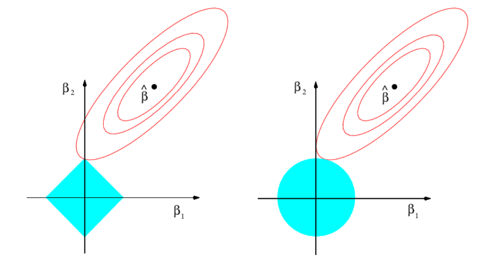

# Chapter 4.6: Geometrical Interpretation of Lasso & Ridge Regularization
- In this chapter, we will be covering on:
1. Recall the budget constraint, t in Lagrangian Duality and explain how it is related to the geometrical interpretation of Lasso and Ridge Regularization
2. Explain the contours and constraint function for Lasso and Ridge Regularization using visualization, and explain the diamond and circle shape constraint touches the contour

# Constraint form of Lasso and Ridge regularization
Recall from `Chapter 4.3: Lagrangian Duality`, we have designed a closed constraint form for the Lasso L1 Regularization, which is as follows:
```math
\begin{aligned}
& \underbrace{min_{\theta}\frac{1}{2n}(||y-\hat{y}||^{2}_2)}_{\text{f(}\theta\text{) - MSE Part in Lasso Loss}} \\
& \text{Such that: }\\
& ((||\theta||_1 - t) \le 0)\\
& \underbrace{||\theta||_1 \le t}_{\text{g(}\theta\text{) - Absolute Value Function Lasso Penalty}}\\
\end{aligned}
```
Where:
$||\theta||_1$ = L1 Norm for vector weights $\theta$
t = Budget Constraint

Thus, we can formulate the same closed constraint form for Ridge L2 Regularization as well, such that:
```math
\begin{aligned}
& \underbrace{min_{\theta}\frac{1}{2n}(||y-\hat{y}||^{2})}_{\text{f(}\theta\text{) - MSE Part in Ridge Loss}} \\
& \text{Such that: }\\
& ((||\theta||_2^2 - t) \le 0)\\
& \underbrace{||\theta||_2^2 \le t}_{\text{g(}\theta\text{) - Sum of Weight Square Ridge Penalty}}\\
\end{aligned}
```
Where:
$||\theta||_2^2$ = L2 Norm for vector weights $\theta$ squared
t = Budget Constraint

**Additional Notes on budget constraint**:
- In `Chapter 4.3: Lagrangian Duality`, we have introduced the budget constraint, t in closed form for Lagrange Duality, but we never explicitly explain its mechanisms. In this note we will be explaining it in detail.
- In Lasso and Ridge Regularization, there exists a value such that the penalty is less than or equal to it. In this case, the value is known as the budget constraint, where its value is greater or equal to both Lasso and Ridge penalty.
- You can think of the budget constraint as the cap limit for the total penalty which can be tuned similar to a hyperparameter. If the budget constraint is set to be too high, it decreases the regularization effectiveness as it allows a larger penalty value, which leads to larger sum of absolute weights in L1 and sum of weights squared in L2, and vice versa.
- Thus, we would tend to tune our budget constraint to a smaller value, so that it helps the regularization to reduce the weight value which reduces variance and reduce the risk of overfitting.
- When the budget constraint value is small, it forces the Lasso Regularization to keep only the weights of important feature and drop the irrelevant feature's weights, which induces sparsity. On the other hand, in Ridge Regularization the small budget constraint t forces it to decrease the value of all features' weights close to 0 so that their sum of squares fit in the "tight" budget.
- One important topic that is not explained well in `Chapter 4.1: Regularization` is that when the weights of a feature is too large, it will cause the model to be too complex, which makes it too sensitive to noise and will tend to fit in the noise values as well. As a result, the model will not generalize well against other datasets.
- Thus, the goal of Lasso and Ridge regularization is to reduce the values of the weights, and in their closed form formula, the role of budget constraint, t, is used to ensure that this is achieved by putting a limit onto the maximum sum of weights.
- Comparing the budget constraint t with the normal regularization constant hyperparameter in the unconstrained form of Lasso and Ridge, $\lambda$ both hyperparameters are correlated with each other. When the regularization hyperparameter, $\lambda$ is small, the regularization strength is weaker which leads to larger budget constraint, t, and vice versa.

For those that are wondering why we need to create a closed constraint form, below will be the analogy and explanation.

**Explanation for close constraint form and budget constraint in Lasso and Ridge**\
The reason we want to choose to formulate a constraint form of Lasso and Ridge regularization is to form a closed geometrical shape for each technique which can be visualized well:


**Graph Explanation:**
- Graph on the left: Geometrical Shape of Lasso in constraint form
- Graph on the right: Geometrical Shape of Ridge in constraint form
- Cyan colour shapes: Constraint formula of Lasso and Ridge Regularization, $||\theta||_1 \le t$ and $||\theta||_2^2 \le t$
- $\hat{\beta}$: The Ordinary Least Squares solution. The center of the contour represents the OLS solution, which loss is at its minimum.
- $\beta_1$: The first feature's weight
- $\beta_2$: The second feature's weight
- Red eclipses: Contour of the OLS solution. In short, each eclipse refers to the all the values of weight $\beta_1$ and weight $\beta_2$ that shares the same loss value, MSE. As the eclipses shift away from the center of OLS solution, the MSE loss value increases

In this scenario, we're using a simple Lasso and Ridge regression model that only consists of 2 features, whose weights are $\beta_1$ and $\beta_2$. Based on the graph, you can see that the geometrical shape of the Lasso and Ridge are different, where Lasso resembles more of a diamond shape while Ridge resembles more of a circle shape.
Thus, this explains why there's non-smooth values in Lasso, as shown algebraicly with absolute value function with non-differentiability at 0, and geometrically with the sharp edges in the diamond. Furthermore, these sharp edges also falls in both X-axis and Y-axis, which explains why sparsity occurs in Lasso that forces 1 weight value to be exactly 0.
On the other hand, in Ridge regularization the smooth values that is found everywhere can be connected both algebraicly with square function, and geometrically with smooth corners around the circle. Furthermore, this could explain why in Ridge, it only reduces the values of the weights close to 0 but not exactly 0.

To further explain it clearly, 
- In Lasso Regularization, when the eclipses, which is the weight values of feature 1,$\beta_1$ and feature 2,$\beta_2$ as x-coordinate and y-coordinate points touches the sharp corners of the "diamond" constraint, it forces the value of one weight to be exactly 0 due to the Y-axis and X-axis (i.e. when the coordinate hits the sharp corner at Y-axis, the second feature's weight, $\beta_2$ will become 0, and when the coordinate hits the sharp corner at X-axis, the first feature's weight, $\beta_1$ will become 0) 
- On the other hand, in Ridge Regularization, when the coordinate which resembles ($\beta_1$, $\beta_2$) hit the smooth corners of the "circle" constraint, the weights value will be reduced to be smaller, but it will not be exactly 0 as the "circle" constraint does not hit the intercept of the Y-axis and X-axis.

**Additional Notes**: As we increase the **number of features** from **2 to 3**, the Lasso shape constraint transform from `diamond` to `polyhedron`, while Ridge shape constraint transform from `circle` to `sphere`. Then, when we increase the **number of features** from **3 to multidimensional**, the Lasso shape constraint transform into `polytope` while the Ridge shape constraint transform into `hypersphere`. As the dimensionality increases, the number of sharp corners will increase as well.

**Conclusion**\
Thus, through comparing both L1 Lasso and L2 Ridge from a geometrical perspective, we can understand now why Lasso forces the weight value to be 0, and why Ridge only reduces the value of the weights by comparing the "diamond" constraint in Lasso and "circle" constraint in Ridge. 

Reference:
1. An Introduction to Statistical Learning in Python Book (Chapter 6: Linear Model Selection and Regularization) - Pg 245-247
2. Geometric Intuition behind Ridge and Lasso Regression: https://medium.com/@indirakrigan/geometric-intuition-behind-ridge-lasso-regularization-994b557f6b5a
