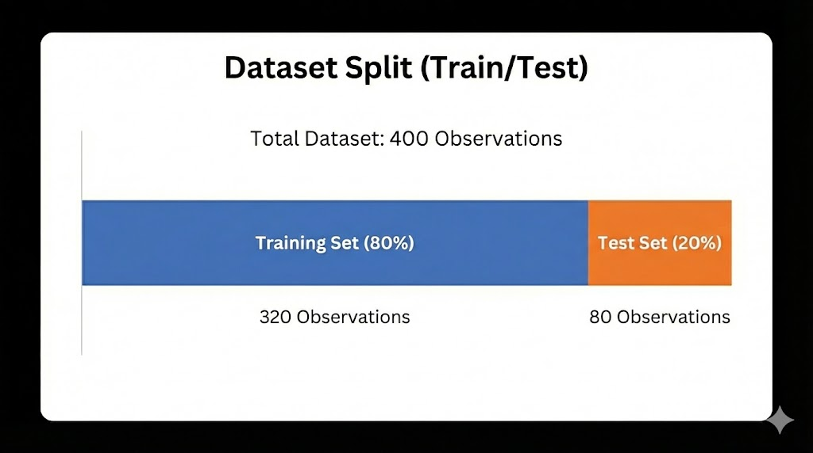
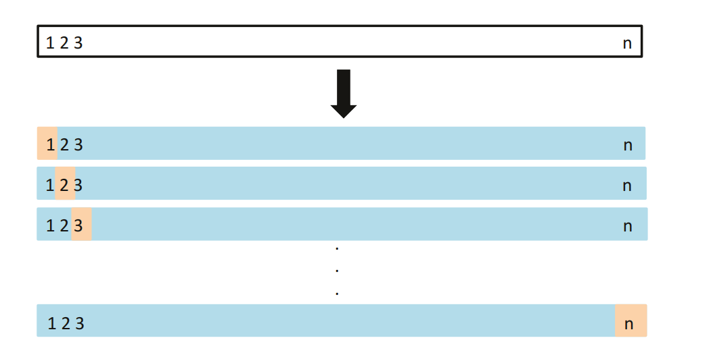
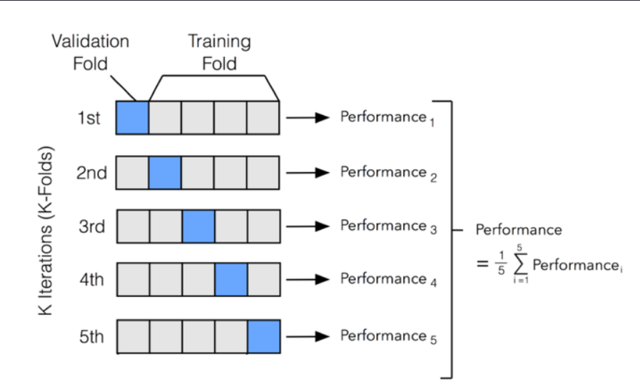
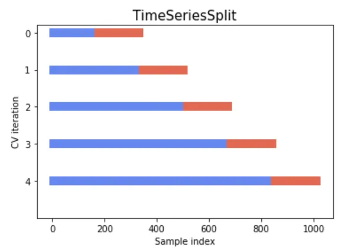
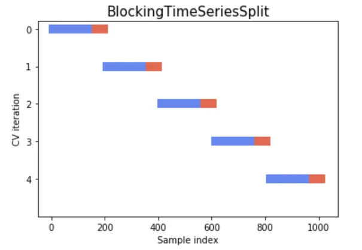

# Chapter 4.2: Cross-Validation
- In this chapter, we'll be covering about:
1. What is cross validation
2. The advantages of cross validation over simple train test split
3. Types of cross validation techniques
4. Bias Variance tradeoffs between the cross validation techniques
5. When not to use cross validation

# Concepts in Cross-Validation
- For beginners in Machine Learning, it is very important to note that in order to test our Machine Learning models on real dataset, we **must** have a completely separated training and testing dataset with unique data samples(rows).\
- This means that there should not be duplicated data samples/data rows across the training and testing dataset, otherwise it could cause data leakage where the model recognize the data from the training dataset and naturally performs well in testing dataset.
- To illustrate, it is like reusing the same revision questions the students have learned from for actual exam where they have memorized and know the answer beforehand. It breaks the integrity and hiding the actual performance of the model.
- In practice, you should train and fit your model on training dataset, and then test it with testing dataset whose value is unseen by the model.
****
- For those that have some experience building ML models and apply it in practice, you might have used or heard of `train_test_split` from Scikit-Learn, where you'll be using this method to split a dataset into training and testing dataset by its ratio.\
- In practice, the usual proportion we usually perform on `train_test_split` is 80 and 20 or 70 and 30, where 70-80% of the dataset is used for training and 20-30% is used for testing. Note that even in simple `train_test_split`, it shuffles the dataset before splitting, so it is not in order. This can be visualized as below:\

- As you can see based on the train_test_split visualization, if we have a total of 400 data(observations), we will be splitting 80% of the dataset(320 observations) into training dataset, while the remaining 20%(80 observations) as testing dataset. 
- However, this is still not the best and most efficient way to test the machine learning model on an independent testing set based on the following reasons:
  1. `Inconsistent result on multiple attempts`: As mentioned above, the dataset is shuffled before splitting, thus ensuring the fairness of the training and testing dataset. However, there might be a chance where the split is too lucky, where both training and testing dataset have similar distribution of data values. For example, the range of data value of a feature is '59-70' for training and '60-71' for testing.
  This causes the model to fit well during training and achieve good performance on testing dataset, since both dataset managed to be split with similar data 'luckily'.
  On the contrary, if the split is 'unlucky', where the training and testing dataset has imbalanced distribution data value, with 1 side having outliers. For example, the range of data value of a feature is '20-51' for training but '40-80' for testing.
  This causes the model to have a poor performance on testing dataset due to the imbalanced splitting between training and testing dataset.
  As a result, this shows that a one-time only train_test_split is not enough to proof that the testing results is valid. Furthermore, based on the experiment results in the book `An Introduction to Statistical Learning in Python`, they have run simple train_test_split 10 times and recorded the testing performance, and each result are different from each other. This shows a high variance, which means high fluctuations in each testing results.
  2. `Lack of observation for training`: In a simple train_test_split, if we set too few observations for training dataset, such as 50/50 proportion between train_test_split, it will result in poor model fitting as it is not being fed with enough data samples. However, since most of the time we are aware of this situation and adjusted to 70/30 or 80/20 split, this is much less of an issue.
- Thus, we will be looking at `Cross-Validation`, which is a more sophisticated and improved version of `train_test_split` to ensure the most optimum dataset splitting and testing result.

**What is Cross-Validation?**
- In short, cross-validation is a more advanced version of a simple `train_test_split`. It first performs train_test_split into training and testing dataset. However, its core concept lies on splitting the training dataset into several subsets, and then performed train_test_split on each subset.
- You can think of cross-validation similar to an average of multiple train_test_split in training dataset, where train_test_split is done on individual subset that is split from the larger dataset.
- This is much improved from the previous `train_test_split`, as instead of relying on a single random split with a chance of being lucky or unlucky with the distribution of data samples/observations, we perform splitting on each separated subset to obtain the average result which is more accurate.
- There are multiple methods of cross-validation, but we will be covering the 3 most known methods:
1. Leave One Out Cross Validation
2. K-Fold Cross Validation

# i) Leave One Out Cross Validation (LOOCV)
- In LOOCV, it works by splitting the dataset into 2 parts, which is the training data and testing data. However, unlike simple train_test_split, it only includes 1 data sample in the dataset as testing data.
- To illustrate, assume we have a total of n data samples in a dataset, the model will be trained on the (n-1) training data, and then it will be tested on a single data sample to output a prediction. The model will not be known of the test data sample during the training phase
- However, to make it even further, we will be repeating this data split for n amount of times, where each data samples will become a single testing data for the model to predict per data split iteration cycle.
- For example, for the first data split we will set $(x_1, y_1)$ as the test data, while $[(x_2, y_2), (x_3, y_3),...,(x_n-y_n)]$ will be the training data. On the 2nd data split, $(x_2, y_2)$ will be the test data, while $[(x_1, y_1), (x_3, y_3),...,(x_n-y_n)]$ will be the training data.
- This iteration of data splitting cycle will continue until we set the final data sample as test data, where $(x_n, y_n)$ as test data, while $[(x_1, y_1), (x_2, y_2),...,(x_{n-1}-y_{n-1})]$ as training data
- In short, we will be splitting a n amount of data samples into (n-1) training data and 1 testing data, and repeat this iteration for n times until each data sample become the test data for each data split. 

LOOCV Visualisation Image from `An Introduction to Statistical Learning in Python`
- Thus, in practice, we will be looping through the iteration, and calculate the MSE loss for each iteration by comparing the single test data and the predicted output. In the end, we will be averaging the sum of MSE for n iterations and average it by n, the amount of dataset, which is as below:

**Test Loss in LOOCV using MSE:**
$$
\begin{aligned}
& \frac{1}{n}\sum_{i=1}^{n}(y_i-\hat{y_i}^{-i})^2\\
\end{aligned}
$$

**Where:**\
n: Total Amount of data samples in a dataset\
$(y-\hat{y_i}^{-i})^2$: MSE (No division by total dataset average as we predict on a single data sample)\
$\hat{y_i}^{-i}$: Prediction for a single data sample $x_i$ using model trained in training dataset excluding i-th sample (For each iteration from i=1 to i=n, we set i as testing dataset and the remainders as training dataset. Thus why we exclude i from training dataset)

**Additional Notes:** During the LOOCV, the test data will not be visible by the model during training as it is splitted. However LOOCV does not protect against duplicated data samples as this might cause training and testing data to have the same value (i.e: A 157cm 47kg 23-year-old Male appearing both in training and testing dataset), and this will still cause data leakage and affect model integrity

**Why LOOCV over simple train test split**
- One of the main advantage of LOOCV over simple train_test_split is `Low Bias`. In simple train_test_split, it takes up a lot of data samples from the dataset as testing values, as discussed earlier with 30-50% of testing data being split from original dataset. This causes the training data size to be smaller, which results in high bias or underfitting as it is too simple for the model to process the data.
- On the other hand, LOOCV takes in an extremely small amount of test data, which is just 1 sample. This lowers down the bias by a lot as it does not reduce much the size of training data which keep it more complex so that the model can learn from it.
- Furthermore, LOOCV yields a more `Consistent Result` than simple train_test_split. This is because in simple train_test_split, it chooses a random 30-50% of data as testing dataset, and each train_test_split will have different testing dataset (Data samples are randomized!)
- On the other hand, in LOOCV it guarantees that each data sample in the dataset will become one single testing data per iteration. This ensures that when you run LOOCV multiple attempts (not multiple iterations, but multiple attempts of n total iterations), it will yield the same result since the testing data being used is consistent for each time (You know the testing data!).
- However, in `Bias-Variance Trade-Offs`, low bias will lead to high variance. This is the case in each LOOCV iteration, as its testing data only relies on a single data sample, and if the data sample is an outlier, it will cause the model to not predict it accurately in that single iteration. (i.e.: Training data of mean 40 while the single testing data has a value of 110)
- As a result, we will look into other methods like K-Fold Cross Validation, where it has a more balanced bias and variance, which we will compare it with LOOCV later on.

# ii) K-Fold Cross Validation
- In K-Fold Cross Validation, it is similar of a "hybrid" between a single train_test_split and LOOCV, where it divides the dataset into a number of groups or "folds", then use each fold as testing dataset for each iteration.
- To explain it clearly, we assume that we have the same n data samples in a dataset as above. In k-fold CV, we will divide the total data samples into k groups("folds"). Then, we will select one group as testing dataset, while the other (k-1) groups as training dataset.
- Then, similar to LOOCV, we will repeat this for k amount of iterations where we will set each and every group to be the testing dataset per iteration
- This combines both the unique splitting of dataset in simple train_test_split and the unique iteration cycles of LOOCV , which forms k-fold CV.
- For better visualization, please refer to the image below which describes how k-fold works visibly. In this scenario we divide the dataset into 5 folds, and for each iteration (up to 5 in total), we will set 1 fold as testing, while the remaining 4 folds as training dataset. This is repeated until all folds are used as testing dataset.

Reference: Zitao's Web (3 min of Machine Learning: Cross Validation)
- Thus, since its mechanism is similar to LOOCV but on a larger scale of testing dataset, the formula will be similar, shown as below:

**Test Loss in k-fold CV using MSE:**
$$
\begin{aligned}
& \frac{1}{k}\sum_{i=1}^{k}\frac{1}{D_i}\sum_{j\in D_i}(y_j-\hat{y_j}^{(i)})^2\\
& \text{Where: }\\
& \underbrace{\frac{1}{k}\underbrace{\sum_{i=1}^{k}\underbrace{\frac{1}{|D_i|}\underbrace{\sum_{j\in D_i}(y_j - \hat{y_j}^{(i)})^2}_{\text{Sum of Squred Errors across multiple test data samples, j in a single fold, }D_i}}_{\text{Average the sum of MSE by the number of data samples in a single fold}}}_{\text{Sum of the average of MSE across all folds}}}_{\text{Average the overall MSE by each fold}}
\end{aligned}
$$

**Where:**\
k: Total amount of folds divided in a dataset\
n: Total Amount of data samples in a dataset\
$D_i$: i-th fold for testing dataset\
$|D_i|$: Total number of data samples in a single fold, $\frac{n}{k}$\
j: Each data sample in the dataset, j=1,...,n\
$\sum_{j\in D_i}$: Each data sample found in a single fold, $D_i$ (A single group(fold) can have multiple data samples)

**Why K-Fold Cross Validation**
- `Low Bias`: Similar to LOOCV, k-fold cross validation also provides lower bias than simple train_test_split due to it using less testing dataset by dividing it into k number of folds, unlike train_test_split that split the dataset into 50/50 or 70/30. The higher the folds, k, the lower the bias. However, its bias is still higher than LOOCV due to it having more testing dataset which will be explained later on.
- `More consistent result on mutiple attempts`: Similar to LOOCV as well, k-fold CV repeats on k iterations where each fold from the 1st to the kth will be set to testing dataset per iteration. This ensures consistent in the results per attempt as the testing dataset is fixed throughout the iterations on multiple attempts
- `Lower Variance`: Unlike LOOCV, k-fold cross validation does not rely on a single testing data, which results in higher fluctuations due to chances of outliers. Instead, it uses a few data samples under the single k fold, where its loss will be of variance per iterations due to the average.

**Conclusion of K-Fold Cross Validation**
In short, k-fold CV is a hybrid of both LOOCV and simple train_test_split, where it combines the advantage of both techniques and form a 

# Comparison between Leave One Out Cross Validation and K-Fold Cross Validation
| Feature               | Leave One Out Cross Validation (LOOCV)                                                                                                                                         | K-Fold Cross Validation                                                                                                                                                                           |
|-----------------------|--------------------------------------------------------------------------------------------------------------------------------------------------------------------------------|---------------------------------------------------------------------------------------------------------------------------------------------------------------------------------------------------|
| Bias                  | Lower Bias due to allowing more data samples in training by using less in testing, keeping the dataset complexity and avoid underfitting                                       | Slightly higher Bias due to slightly fewer data samples in training by allowing more in testing                                                                                                   |
| Variance              | Higher Variance due to a single testing data, which results in higher fluctuations of loss and prediction per iteration, especially with outliers                              | Slightly lower Variance due to using more data samples for testing, which avoid the model to be bias of a single outlier during testing and ensure the loss will be more averaged per iteration   |
| Computational Power   | Higher computational cost due to larger amount of iterations as it loops through each data sample and set it to a single test data, leading to O($n^2$) complexity cost        | Slightly lower computational cost due to it loops through a group(fold) of data samples and set them as a group of testing data, leading to O(n*k) complexity cost                                |

- Thus, as you can see, k-fold cross validation is more well-balanced in terms of the bias and variance, making it less susceptible to outliers than LOOCV due to lower variance. Even though it has a slight bias than LOOCV but the difference is almost negligible in practice and the decrease in variance by increasing bias is more valuable in this case. 
- Lastly, its slightly lower computational cost is key here as it is able to ensure the Machine Learning Model is able to run under lower cost and higher speed.
- Thus, k-fold cross validation is often preferred by ML Engineers in most scenarios due to its balance nature and lower cost than LOOCV.
more robust solution. Its well balance of bias and variance, along with lower computational power than LOOCV makes it a more preferred choice when dealing with data in Machine Learning.

# iii) Stratified K-Fold Cross Validation
- In Stratified K-Fold Cross Validation, it combines both stratified sampling and k-fold cross validation to form an even more robust data preprocessing technique.
- Its main goal is to prevent class imbalance by ensuring the class data is distributed fairly across all groups(folds). This is essential when we're dealing with categorical dataset problem like email spam, heart disease prediction, etc.
- To illustrate, lets take in an example of an email spam dataset with a target categorical output of "spam"(class 0) or "not spam"(class 1). In our dataset there are 80 "spam" data samples and 20 "not spam" data samples. 
- When we perform simple train_test_split or K-Fold Cross Validation without stratify it, we will be splitting the number of data sample class at random. For example, 

Email Spam Dataset:\
Class 0 (Spam): 80 data samples\
Class 1 (Not spam): 20 data samples\

Simple 80/20 train_test_split (No Stratify):\
Training dataset: 80 Class 0, 0 Class 1\
Testing dataset: 0 Class 0, 20 Class 1

- This cause the class in our dataset to be extremely imbalanced, as our model is trained on all "spam" email, while it is tested on all "not spam" email, which results in poor accuracy.

- However, when we apply stratify in our data splitting technique, the number of data samples per class will be proportionate to the original dataset class proportion.
- For example, using the same 80/20 train_test_split and dataset, by applying stratify,

Simple 80/20 train_test_split (Stratify):\
Training dataset: $80\cdot \frac{80}{100}=64$ Class 0, $20\cdot \frac{80}{100}=16$ Class 1\
Testing dataset: $80\cdot \frac{20}{100}=16$ Class 0, $20\cdot \frac{20}{100}=4$ Class 1
- To further explain, since we split our dataset into 80% training and 20% testing, we will also split the same proportion for our class as well, which is 80% of class 0 and 1 in training dataset, while 20% of class 0 and 1 in testing dataset
- As a result, it ensures fair and balanced data class sample distribution across training and testing dataset
- By applying stratify into K-Fold cross validation, the example process is as below:
1. We split the dataset into 10 folds, where 1 fold will be used as validation fold, and the remaining 9 folds will be used as training fold
2. Then, we divide the data class samples so that it is evenly distributed across training and testing dataset (90/10 split)\
   Training dataset: $80\cdot \frac{90}{100}=72$ Class 0, $20\cdot \frac{90}{100}=18$ Class 1\
   Testing dataset: $80\cdot \frac{10}{100}=8$ Class 0, $20\cdot \frac{10}{100}=2$ Class 1
3. As you can see, for each fold we have 8 data samples for Class 0, and 2 data samples for Class 1. This matches the proportion of the dataset, which is 80% of Class 0 and 20% of Class 1
4. Since in our training dataset we have 9 folds, we will have 72 Class 0 and 18 Class 1. On the other hand, in our testing dataset we have 1 fold, we will have 8 Class 0 and 2 Class 1

**Conclusion for Stratified K-Fold Cross Validation**
- In short, Stratified k-fold CV implements stratify on top of k-fold CV which helps it to ensure the balanced distribution of classes, which prevent bias of model towards 1 class during training which results in poor performance. 
- However, stratify k-fold CV only helps to minimize the risk of data class sample imbalance during splitting, thus if the dataset itself is heavily imbalance (i.e. 99 Class 0 and 1 Class 1), stratify k-fold CV still can't prevent our model poor performance due to the lack of Class 1 data samples. 
- To resolve this problem, we will have to switch from using techniques that target the model to techniques that target dataset level of handling data imbalance, such as SMOTE, random oversampling and random undersampling  

# iv) Grid Search Cross Validation
- In Grid Search CV, it implements hyperparameter tuning on top of k-fold CV. In short, it is the combination of Grid Search and k-fold CV
- Essentially, it helps you test all potential values of hyperparameter(s) and find the best value, while simultaneously calculates the performance of your model using k-fold CV
- To illustrate, below is a pseudo-code sample of using Scikit-Learn GridSearchCV and Elastic Net Regression model
```aiignore
from sklearn.model_selection import GridSearchCV
from sklearn.linear_model import ElasticNet
elastic_net_param_grid = {
    'alpha': [0.1, 0.01, 0.001, 0.0001],
    'l1_ratio': [0.1, 0.01, 0.001, 0.0001]
}
elastic_net_model = ElasticNet(max_iter=2000)
elastic_net_grid_search = GridSearchCV(estimator=elastic_net_model, param_grid=elastic_net_param_grid)
```
- In this scenario, we have created a set of possible values for our regularization constant(alpha) and Lasso L1 regularization ratio (l1_ratio) as our parameter grid, which is a 4x4 grid
- Then, Grid Search CV will generate all the potential combinations of the values of both hyperparameter (4*4=16) across all folds and provide the hyperparameter values that yield the best result of the model (highest metrics such as MSE, RMSE, R^2 or accuracy)
- Thus, the process of Grid Search CV is as follows:
1. If we apply a k-fold CV of 5 folds into ElasticNet model, the model will first separate the dataset into 5 different folds, where 1 fold will be used as validation fold and the remaining 4 folds as training folds. This will be repeated for 5 iterations to use different folds as testing dataset.
2. In the first k-fold CV, GridSearchCV will use the first combination of hyperparameters (alpha=0.1 & l1_ratio=0.1) to test the accuracy of the model.
3. The GridSearchCV will then repeat the same k-fold CV multiple times but with different trials and combinations of the hyperparameters and calculate their accuracy. (16 combinations * 5 folds = 80 folds)
4. In the end, based on our 5 folds per k-fold CV and a total of 16 hyperparameters possibility, the GridSearchCV will attempt k-fold CV 16 times in total and a total of 80 folds. Afterwards, the GridSearchCV will provide the most optimal combination of hyperparameters value that lead to the best performance of the model.

- While GridSearchCV is powerful in finding the best hyperparameter values by testing all combinations and estimate the model performance using k-fold CV, it has 2 main disadvantages, which can be resolved using different methods:
1. `High Computational Power`: As GridSearchCV brute forces all possible combinations of hyperparameter values, if we have a large amount of hyperparameter value choices in our grid (i.e. 20x5), the number of folds will quickly skyrocket which result in slow performance or even crash due to high computation cost. To resolve this we can implement RandomizedSearchCV
2. `Biased (Over Optimistic) estimation`: The main problem behind GridSearchCV is that if the same dataset is used for both hyperparameter tuning and performance metrics calculation, it will test the combinations of hyperparameter values using the same validation folds. This results in data leakage, where the same validation folds are reused during tuning the hyperparameters, and during performance metrics calculation it has know the value of the validation folds beforehand. However, this can be solved using Nested Cross Validation.

# v) Randomized Search Cross Validation
- In RandomizedSearch CV, it is a more efficient alternative for GridSearchCV. Instead of testing all potential combinations of hyperparameter values, it only test a random n amount of combinations of hyperparameter values only.
- As a result, it is a more efficient and less computational cost of GridSearchCV, where it only test a limited random amount of combinations, rather than all potential combinations of hyperparameter values.
- To illustrate, we will be using the same pseudo-code sample of using Scikit-Learn RandomizedSearchCV and Elastic Net Regression model
```aiignore
from sklearn.model_selection import RandomizedSearchCV
from sklearn.linear_model import ElasticNet
elastic_net_param_distribution = {
    'alpha': [0.1, 0.01, 0.001, 0.0001],
    'l1_ratio': [0.1, 0.01, 0.001, 0.0001]
}
elastic_net_model = ElasticNet(max_iter=2000)
elastic_net_grid_search = RandomizedSearchCV(estimator=elastic_net_model, param_distributions=elastic_net_param_distribution, n_iter=5)
```
- In this scenario, we use back the same set possible values for our regularization constant(alpha) and Lasso L1 regularization ratio (l1_ratio) as our parameter distributions or choices.
- Then, in RandomizedSearchCV, unlike testing on all possible combination of hyperparameter values (16), we only test on n random combination of hyperparameter values (5).
- As a result, we could reduce the computational cost of the search model, while retaining the similar dynamic power of GridSearchCV and k-fold cross validation
- Below is the process of RandomizedSearchCV, which is similar to what we see in GridSearchCV:
1. If we apply a k-fold CV of 5 folds into ElasticNet model, the model will first separate the dataset into 5 different folds, where 1 part will be used as validation fold and the remaining 4 folds as training folds. This will be repeated for 5 iterations to use different folds as validation folds.
2. For each iteration of k-fold CV up to n_iter(number of random combination in RandomizedSearchCV), RandomizedSearchCV will use a random combination of hyperparameters (alpha=0.1 & l1_ratio=0.1) to test the accuracy of the model.
3. The GridSearchCV will then repeat the same k-fold CV 5 times(n_iter amount) but with different random combinations of the hyperparameters and calculate their accuracy. (5 random combinations * 5 folds = 25 folds)
4. In the end, based on our 5 folds per k-fold CV and a total of 16 hyperparameters possibility, the GridSearchCV will attempt k-fold CV 16 times in total and a total of 25 folds. Afterwards, the GridSearchCV will provide the most optimal combination of hyperparameters value that lead to the best performance of the model.
- Thus, by comparing RandomizedSearchCV and GridSearchCV, RandomizedSearchCV lowers down the number of folds from 80 folds to 25 folds (full combination vs randomized limit), which reduce the computational cost.

However, RandomizedSearchCV comes with its disadvantages as well:
1. `Limit Hyperparameter Tuning`: Since RandomizedSearchCV only test with a limited amount of random hyperparameter combination values instead of all potential combination. Thus, it may mises out the global optimum combination of the hyperparameter values, or in simple words, the true most optimum hyperparameter values that results in best model performance. However, it often is able to find highly optimum hyperparameter values for most cases.
2. `Biased (Over Optimistic) estimation`: Similar to GridSearchCV, RandomizedSearchCV also uses validation folds to tune the hyperparameter values, which also results in data leakage if the same dataset is used for hyperparameter tuning and model metrics calculation, since the model has seen the testing data beforehand while tuning the hyperparameters, which leads to optimistic model metrics evaluation later on.

# vi) Nested Cross Validation
- Nested CV is a robust and advanced method to resolve the over-optimistic estimation problem faced by both GridSearchCV and RandomizedSearchCV.
- Unlike both GridSearchCV and RandomizedSearchCV that uses 1 loop only for both model performance evaluation and hyperparameter tuning, Nested CV uses 2 loops, an outer and inner loop to separate those mechanisms, which prevents data leakage due to tuning hyperparameters on validation folds.
- Below is the process of NestedCV:
1. Outer Loop: The dataset is split into 5 folds using k-fold CV mechanisms. 1 fold will be used as validation fold while the other 4 folds will be used as training fold. The outer loop will be iterated 5 times so that each fold will become the validation fold once per iteration
2. Inner Loop: Within the inner loop, the 4 training folds will be further divided into inner training fold and inner validation fold. Nested CV will then undergo GridSearch, where it will loop through all potential combination of hyperparameter values by tuning it and train it on the training folds. It will then select the combination of hyperparameter that has the highest performance metrics.
3. After the training fold, Nested CV will go back to the outer loop to test the selected hyperparameter value onto the validation fold and record the test performance.
4. Lastly, the Nested CV will repeat step 2 to 3 for 5 iterations to complete the outer loop cycle. In the end, it will average the 5 total test scores to provide an unbiased performance metrics.
- To make it more clearer, below is the comparison between Nested CV and GridSearchCV by visualizing their iteration cycle

a) GridSearchCV:
1. K-Fold CV (5 iterations for 5 folds total)
2. Fine tune 1st potential combinations of hyperparameters
3. K-Fold CV (5 iterations for 5 folds total)
4. Repeat Step 2 and 3 for total combinations of hyperparameters
5. Output model performance and most optimal hyperparameter

b) Nested Cross Validation:
1. K-Fold CV (1st iteration: 1/5 folds)
2. Perform GridSearch on all combinations of hyperparameter on training folds (inner loop)
3. Test the selected hyperparameter combination on validation fold (outer loop)
4. K-Fold CV (2nd iteration: 2/5 folds)
5. Perform GridSearch on all combinations of hyperparameter on training folds (inner loop)
6. Test the selected hyperparameter combination in validation fold (outer loop)
7. Repeat Steps 1-3 or Steps 4-6 until final K-Fold CV (5th iteration: 5/5 folds)
8. Perform GridSearch on all combinations of hyperparameter on training folds (inner loop)
9. Test the selected hyperparameter combination in validation fold (outer loop)
10. Output model performance and most optimal hyperparameter

- Unlike GridSearchCV that loops through the all potential combinations of hyperparameters after all folds in K-Fold CV, Nested CV loops through all potential combinations of hyperparameters in 1 fold of K-Fold CV, and repeat the process for k folds.
- This helps prevent data leakage by preventing the model to fine tune the hyperparameter in the validation fold across all folds in K-Fold CV by separating the fine tuning process into each fold and for training folds only.

# vi) Cross Validation in time series datasets
- In time series dataset, it refers to a set of data samples whose values are dependent on the previous ones. This means that the data samples that represents the future data are dependent on the past data.
- To illustrate, let's take stock prices data samples and arrange them as below:
Stock Price Data Sample:
1. Data Sample 1-50: January Stock Prices
2. Data Sample 51-100: February Stock Prices
3. Data Sample 101-150: March Stock Prices
- As you can see, the value for Data Sample 51-100 which represents the February Stock Prices depends on the value for Data Sample 1-50 which is the January Stock Prices, and the same can be said for March to February Stock Prices.
- Thus, in order for us to predict the "future" value using machine learning model, we'll use the dataset from the "past" to predict the future values. (i.e. use Data Sample 1-50 to predict February Stock Prices Data Sample 51-100)
- As a result, we cannot use typical cross validation to split time series dataset. This is because normal cross validation split the dataset on random by shuffling it without caring their relationship or importance. 
- Hence, we might get a training fold of February Stock Prices and validation fold of January Stock Prices, which is an inaccurate way to train our model on as we're training "future" values to predict "past" values. This creates false positives and "data leakage" of future data values to the model, which causes our model to being over optimistic in its prediction and performance.
- In order to resolve this problem, we can perform `time series cross validation` to split dataset, specifically for handling time series dataset

**Time Series Cross Validation (TSCV)**
- In TSCV, it implements K-Fold CV but with a slightly adjusted approach of setting the training and validation fold.
- In normal K-Fold CV, after it has separate the dataset into k=5 number of folds, the 1st fold will become validation fold, while the other 4 folds become training fold. In the 2nd iteration, the 2nd fold will become validation fold, while fold 1,3,4,5 become training fold. This is repeated for k(5) number of iterations until all folds become validation fold.
- However, in TSCV, we will still be splitting the dataset into k number of folds, but the validation fold will always be ahead of the training folds.
- This means that we will be using data samples from the "past" as training folds to train the model, and test its performance using the "future" data samples as validation fold. This prevents data leakage, where we do not show the "future" data values to the model during training with "past" data values to prevent over optimistic performance
- To illustrate, assume we're separating the dataset into 5 folds and use Stock Price Dataset as below:
Stock Price Data Sample:
1. Data Sample 0-200: January Stock Prices (Fold 1)
2. Data Sample 201-400: February Stock Prices (Fold 2)
3. Data Sample 401-600: March Stock Prices (Fold 3)
4. Data Sample 601-800: April Stock Prices (Fold 4)
5. Data Sample 801-1000: May Stock Prices (Fold 5)


Reference: Cross Validation in Time Series by Soumya Shrivastava

- As you can see, for the 1st iteration, TSCV used the 1st fold (January Stock Prices) to train the model and test it using the 2nd fold (February Stock Prices) as validation fold
- For the 2nd iteration, TSCV used the 1st and 2nd fold (January - February Stock Prices) to train the model and test it using the 3rd fold (March Stock Prices)
- This process is repeated until the last iteration, where TSCV used all "past" data to predict the last fold which is the "future" data
- Lastly, the model will store all loss value(i.e. MSE or RMSE) for each iteration into an array, and averaged the loss value to give an overall model performance metrics
- As a result, this ensures that the model is always trained on "past" data and tested on "future" data to prevent any optimistic and wrong performance
- However, one problem of TSCV lies in irrelevancy of data, as we're adding all "past" data into the next iteration to predict the "future" data. Some of the "past" data might be too old such that it does not contribute effectively to affect the "future" data, and it acts more like a noise. 
- For example, while predicting May Stock Prices, we use all "past" data from January to April. The data from January Stock Prices might be irrelevant and does not create a large impact towards May Stock Prices. 
- Thus, by adding the irrelevant January Stock Prices, the model might be confused due to the irregular pattern which causes its performance to drop.
- Thus, we can try another technique which is called `Blocking Time Series Split` to resolve this issue.

**Blocking Time Series Split (Rolling Windows Cross Validation)**
- In Blocking Time Series Split, we're masking the "past" data of the previous iteration in the next iteration. This prevents the model from using the "past" data of previous iteration and compare it with "future" data of previous iteration in the next iteration.
- To illustrate, let's use the same dataset and the same fold as TSCV:
Stock Price Data Sample:
1. Data Sample 0-200: January Stock Prices (Fold 1)
2. Data Sample 201-400: February Stock Prices (Fold 2)
3. Data Sample 401-600: March Stock Prices (Fold 3)
4. Data Sample 601-800: April Stock Prices (Fold 4)
5. Data Sample 801-1000: May Stock Prices (Fold 5)


Reference: Cross Validation in Time Series by Soumya Shrivastava
- To visualize it, in the 1st iteration we use the January Stock Prices as training fold to predict the February Stock Prices as validation fold
- In the 2nd iteration, we mask the January Stock Prices("past" data in previous iteration), and use February Stock Prices("future" data in previous iteration) as training fold to predict the March Stock Prices as validation fold
- This process is repeated until the last iteration where we hide all "past" data in previous iteration (January-March), and use April Stock Prices("future" data in previous iteration) as training fold to predict the May Stock Prices as validation fold.
- Essentially, for each iteration we mask the previous "past" training fold data and set the previous "future" validation fold data as the new training fold in the next iteration. This prevents the model to learn data that are too old and irrelevant, which act as noise that reduces the model ability to find the time-series pattern.
- To show it even clearer:
1. First Iteration:
   Training Fold: January Stock Prices ("Past Data")
   Validation Fold: February Stock Prices ("Future Data") 
2. Second Iteration:
   Training Fold: February Stock Prices ("Past Data")
   Validation Fold: March Stock Prices ("Future Data")
   Masked Data: January Stock Prices (Why? To prevent the model learn past data in the previous iteration(January) that is irrelevant and does not impact towards "future" data in the current iteration(March))
3. Final Iteration:
   Training Fold: April Stock Prices ("Past Data")
   Validation Fold: May Stock Prices ("Future Data")
   Masked Data: January-March Stock Prices (Why? To prevent the model learn past data in the previous iteration(January-March) that is irrelevant and does not impact towards "future" data in the current iteration(May))

- Thus, this effectively ensures no irrelevant and old data from previous iteration folds are added into the next iteration to confuse the model

**Additional Notes:**\
In time series cross validation, we have to mask the training fold in previous iteration at next iteration due to data irrelevancy between past and future data, while in normal cross validation we don't have to worry about that. 
This is because time series data, one assumption is that data are timely-dependent on each other, where the "future" data always depend on the "past" data. That's why we use "past" data to feed the model and let it predict the "future" data. 
As we mix the previous "past" and "future" data sample together into the next iteration, some of the "past" data samples might be too old that it is irrelevant and it no longer contributes effectively into affecting the "future" data values. 
By adding those too old data samples, the model might be confused and perform worse in predicting "future" data as those old samples start to act as noise. Thus, this is why we prefer `Blocking Time Series Split` rather than normal `Time Series Cross Validation`
However, we do not have to worry about that in normal cross validation, as all data samples are IID, meaning they are independent of each other, which fits Linear Regression assumption. 
Furthermore, in each CV iteration, you can think of it as we're restarting a new fresh machine learning model, where we use a different fold of validation and training fold per iteration. 
This is why it doesn't matter if the validation fold in previous iteration is used as training fold in the next iteration, as each iteration represents a different version of machine learning model, and they are not dependent on each other. 
Thus, we're just averaging the performance metrics of the models across all iterations and ensure lower bias in our performance, which is not just a "lucky split" compared with simple train_test_split.


# Special: When not to use Cross Validation
- Even though throughout this chapter we are talking the advantages of Cross Validation and why you should use it. However, in some scenarios it'll be more beneficial to use simple train_test_split rather than Cross Validation

a) Large Dataset Values ( > 1,000,000 rows)
- When you have extremely large amount of data samples in a dataset, performing cross validation will consume a lot of computational power. For example, if we perform 10-fold CV, the amount of data splitting it takes is (100,000*10=1,000,000) testing folds in total and (9000,000*10=9,000,000) training folds in total. This adds up to 10,000,000 rows of data to compute which is 10x the amount of original data.
- However, when we perform a simple 80/20 train_test_split, we will get 800,000 of training samples and 200,000 of testing samples, which doesn't consume much computational power compared to our 10-fold CV.
- Thus, when the number of data samples increases, the variance and bias of the model will become more stable (less variance as the number of testing samples is vast which is less likely to be affected by outliers, and less bias as the number of training samples is large enough to prevent the model from learning too simple). This reduces the benefits of cross validation and instead become a computational burden

b) Large Models with many parameters (i.e. Deep Learning models like CNN, Transformers, and LLMs)
- For deep learning models and LLMs with millions and billions of parameters, computationally it takes weeks or months to completely trained it once using a full dataset
- As a result, it is computationally exhausting and wastage if we perform cross validation and retrain the model for 10 times and consume 10x the duration. This is unrealistic and the performance boosting in return is not worth over wasting so much computational resources, which is just low in return of investments.
- Thus, many deep learning models just use a simple train_test_split to split the dataset into training and testing fold, without using excessive CV.
- However, CV is still used in many Machine Learning models, such as Random Forest, Decision Trees, and Gradient Boosting where we have many hyperparameters to tune and CV can help us get a less biased model metrics and select the most optimal hyperparameters. 
- This is exceptionally useful still in many cases like fraud detection, where we use stratified k-fold CV combine with other techniques like SMOTE for handling highly imbalanced dataset and minimize the bias of our model from being over optimistic in its performance and prediction.

# Reference:
1. Zitao's Web (3 min of Machine Learning: Cross Validation): https://zitaoshen.rbind.io/project/machine_learning/machine-learning-101-cross-vaildation/
2. Cross Validation in Time Series by Soumya Shrivastava: https://medium.com/@soumyachess1496/cross-validation-in-time-series-566ae4981ce4
