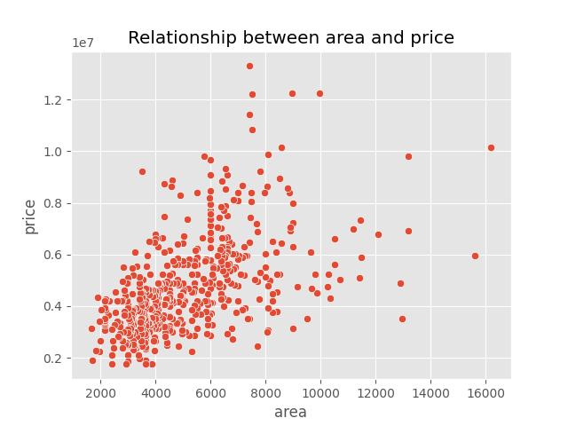
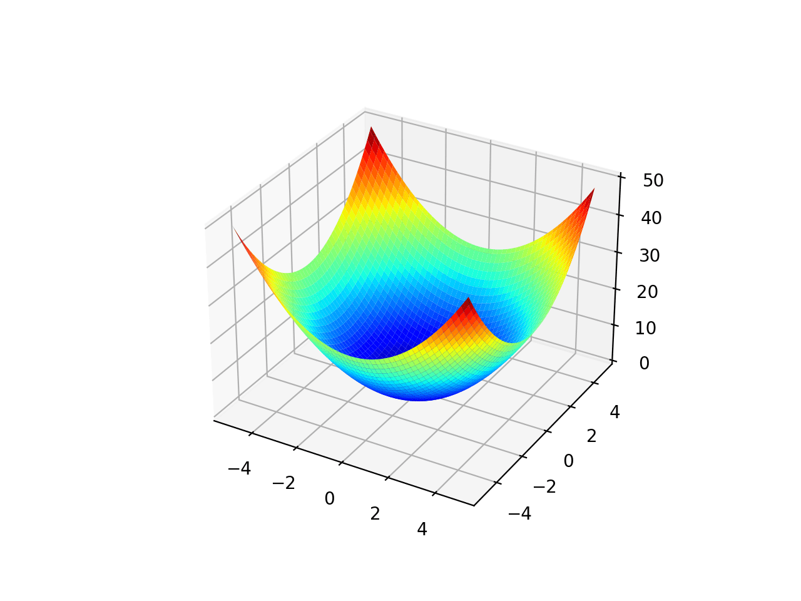
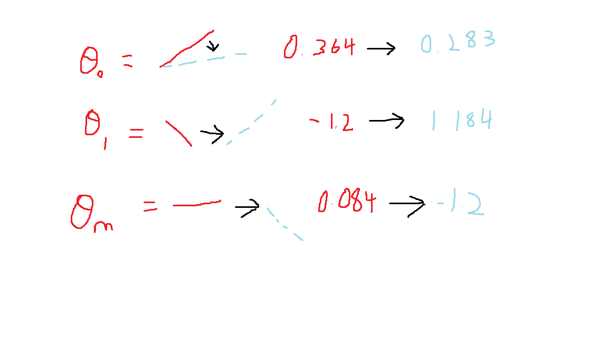
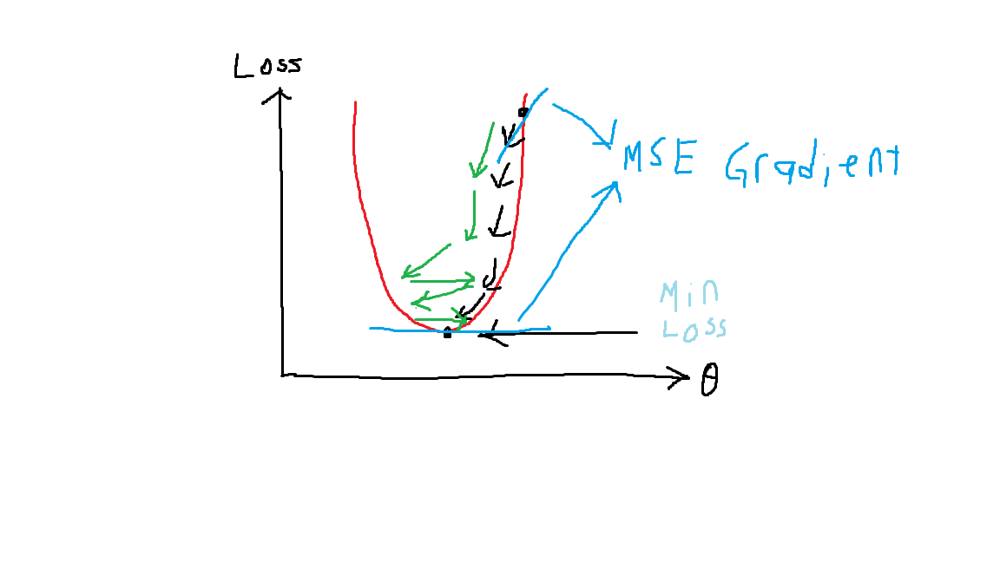

# Chapter 1.1: Intro to Linear Regression
- In this chapter, we will be learning about
1. What is linear regression, the simplest machine learning model
2. Simple Linear Regression and Multiple Linear Regression
3. Loss Function using Mean Square Error
4. How to adjust best fit line in Linear Regression through optimization techniques like Gradient Descent and Ordinary Least Squares

**1. What is Linear Regression?**
- 
- In simple terms, the most basic form of Linear Regression is very similar to the line function that most have learnt during high school, which is as below:\
$$y = \theta_0 + X\theta_1 + \epsilon$$
Where:
- y = The output (actual value)
- $\theta_0$ = The y-intercept (we will call it as bias)
- $\theta_1$ = The gradient corresponding to X (we will call it as weights)
- X = The dependent variable (we will call it as feature)
- $\epsilon$ = The error value for random noise or related feature that are not included (This will be negligible for most of the time)

**Example: House Price Dataset**
- Let's take a house dataset for example, where it consists of 1 dependent variable(**area of the house**) and 1 responding variable(**price of the house**), as shown below:

- So our X will be the area of the house, while y is the price of the house

**What we do in Linear Regression is to predict the price of a house given its area accurately by adjusting the weights of the area feature, along with the bias to create the best fit line.**

This is the simplest Linear Regression model, often called as **Simple Linear Regression (SLR)**. It is used to predict the `output` value based on a single `dependent variable(feature)`.

However, in many real-world cases SLR is less relevant as rarely are there only a single variable(feature) that affects the output value.

Take the housing dataset for example, the output(`price`) of the house is not only affected by its `area`, but also many other features like `number of bedrooms`, `number of bathrooms`, `furnish_status`, and more.

Thus, we will need a different approach to handle such problems, where we will be introducing **Multiple Linear Regression (MLR)**.

**Multiple Linear Regression (MLR)**
-
The general formula of MLR can be described as below:
$$y = \theta_0+X_1\theta_1+X_2\theta_2+...+X_m\theta_m$$
**Where:**
y = The output (actual value)\
$\theta_0$ = The bias mentioned above\
$\theta_1$ = The weights corresponding to the first feature\
$X_1$ = One of the features that affects the final output\
$\theta_m$ = The weights corresponding to the mth feature\
$X_m$ = The mth feature in a dataset

In short, each X's represents a single variable(feature) that influence the y(output), and each $\theta$ is the gradient(weights) corresponding to each variable(feature). You may think of it as below:\
1. $X_1$: `Area of house`
2. $X_2$: `Number of bedrooms`
3. $X_3$: `Number of bathrooms`\
...
4. $X_m$: `The furnish status of the house`
5. y: `Price of house`

This can be rewritten cleanly using the summation notation:
**Multiple Linear Regression (Summation):**
$$y = \theta_0 + \sum_{j=1}^{m}X_j\theta_j$$
**Where:**
y = The output value\
$\theta_0$ = The bias value\
$\theta_j$ = The jth weights from 1 to m\
$X_j$ = The jth feature value from 1 to m

Furthermore, in practical coding when building these algorithms, we'll be representing these variables in matrices using numpy. This makes it easier to compute instead of using loops through the summation. 

Before we show the matrix form of Linear Regression, here are the constant notations that'll be used throughout the notes and you should know to prevent confusion for the readers.

Suppose we have a dataset, with m features and n data samples. We then set y as the target values with X as the input values, then $\theta$ as the weights values and b as the bias value. Thus, the matrix format will be as below:
$$
y=\begin{bmatrix}
y_1\\
y_2\\
y_3\\
...\\
y_n\\
\end{bmatrix},
X=\begin{bmatrix}
X_{11} & X_{12} & X_{13} &...& X_{1m}\\
X_{21} & ... & ... & ... & X_{2m}\\
X_{31} & ... & ... & ... & X_{3m}\\
... & ... & ... & ... & ...\\
X_{n1} & X_{n2} & X_{n3} & ... & X_{nm}\\
\end{bmatrix},
\theta=\begin{bmatrix}
\theta_1\\
\theta_2\\
\theta_3\\
...\\
\theta_m\\
\end{bmatrix},
b=\begin{bmatrix}
b_1
\end{bmatrix}
$$

The shape of each matrix will be:
$$
\begin{aligned}
\text{Shape y: } (n, 1), \\
\text{Shape X: } (n, m), \\
\text{Shape }\theta\text{: } (m, 1), \\
\text{Shape b: } (1, 1)
\end{aligned}
$$

**Thus,**
**Multiple Linear Regression (Matrix form):**
$$y = X\theta + b$$
**Where:**
y = The output matrix with shape of (n, 1)\
X = The input matrix with shape of (n, m)\
$\theta$ = The weight matrix with shape of (m, 1)\
b = The bias with shape of (1, 1)

Based on the matrix form of each variable, it is closely resembles:
$$
\begin{aligned}
& y = X\theta + b\\
&\approx y_i = \theta_0 + \sum_{j=1}^{m}x_{ij}\theta_j, i = 1,...,n 
\end{aligned}
$$
- Where $y_i$ represents the single data sample target value and $X_i$ represents the single data input values, with i as data sample index from 1 to n.
- In the general Multiple Linear Regression above, we're simplifying it by excluding the index i, but in reality it is a formula for a single data sample. If we want to include all data samples, we'll be using index i such that $y_i$ and $x_ij$ is the target and input value for the ith data sample

Thus, in conclusion below is the finalized notation that we'll reuse throughout the notes:
**a) General:**\
m: Total number of data features\
n: Total number of data samples

**b) Summation:**\
i: Index for data samples from 1 to n\
j: Index for data features from 1 to m\
$y_i$: Target Output for the ith index\
$x_{ij}$: Input for the ith index and jth feature\
$\theta_j$: Weights for the jth feature\
$\theta_0$: Bias

**c) Matrix:**\
y: Target output matrix with shape of (n, 1)
X: Data input matrix with shape of (n, m)
$\theta$: Data feature weights with shape of (m, 1)
b: Bias with shape of (1,1)

**Additional Note**:
- From this chapter onwards, we'll be introducing 2 ways of writing the formulas, which are the `Summation` and the `Matrix form`. For the first few chapters we'll be covering both but both of them are the same. Furthermore, for most concepts we'll be using the matrix format since it is more intuitive and practical in code as we'll be using matrix instead of summation loops, as per the author's opinion.
- If you're confusing how we can do summation using matrix, remember we use dot product where we multiply each values and sum them up together, for example $X\theta$ will multiply and sum them up across all number of weights, m. For more details can refer to dot product between matrix and matrix shape dimension compatibility
- If you're wondering how we can add bias, b without affecting dimension error matrix, we're doing something called broadcasting where we add the single (1,1) bias into each result samples from 1 to n.

In Multiple Linear Regression, you can imagine it as a multidimensional graph where different variables at each dimension is affecting the value of the output. For instance:\

**Thus, in MLR we have to adjust the value of each weights for each feature, and the bias to achieve the best fit line. It is like twisting the knob so that the line becomes best fit.**\

# 2. Loss Function
- Now that we have learnt the 2 types of Linear Regression, which are `Simple Linear Regression` and `Multiple Linear Regression`, how do we know the accuracy of our Linear Regression model against a given dataset?
- The answer lies in calculating the errors of our model, which means how wrong our model is at predicting the correct value

# 2a) Loss Function
- In Linear Regression, there are a lot of methods used to calculate the loss of our model. We'll be discussing all the loss functions for Linear Regression and other models in future chapter but for now we'll be focusing on the most common model, which is `Mean Square Error`.

**Mean Square Error (MSE)**
- In continuous regression model, we'll be using Mean Square Error (MSE), as it takes the square of the difference between actual value and predicted value.
- This means if the difference (loss) is high, the penalty will be higher as the value is squared.
- Additionally, we have divided the total loss with the total number of dataset (n) to calculate the average loss. This is to prevent gradient exploding due to large loss value.

**Formula (Summation):**
$$J(\theta)=\frac{1}{2n}\sum_{i=1}^{n}(y_{i}-\hat{y_{i}})^{2}$$

**Where:**
1. $J(\theta)$: Cost function (MSE)
2. n = Number of total rows (Total dataset count)
3. $\hat{y_{i}}$ = Predicted value for the ith data sample
4. $y_i$ = Actual value for the ith data sample

**Formula (Matrix):**
$$J(\theta)=\frac{1}{2n}||y - \hat{y_{i}}||_2^{2}$$

**Where:**\
$||y-\hat{y}||_2^2$: L2 Norm of Mean Square Error

Do not be worry about the sudden change in appearance of the MSE in summation and matrix form, it is equivalent where the L2 Norm is used to represent that the MSE output is in vectorized form with a 2 dimensional shape of (n, 1) instead of a single data sample in summation form. We'll be explaining more about L1 and L2 norm in `Chapter 4.1: Regularization` later on.

**Additional Note**: The 2 in the denominator is often used in many research papers and articles to cancel out the 2 in power rule derivation, $(\hat{y}_i-y_i)^2$ later

**Conclusion of MSE**
In conclusion, the goal of the loss function with MSE is to calculate the difference between actual value and predicted value, and adjust our Linear Regression line to best fit the dataset so that the difference will be lower. This is known as minimizing our loss function which will be discussed later in `Section 3: Optimization in Linear Regression`.

# 3. Optimization in Linear Regression
- In Linear Regression model, in order to optimize the model such that it is performing at its best, we'll need to adjust the weights so that the line is in best fit and the loss is minimized
- This is quite easy to understand as based on Mean Square Error, when our model loss is decreasing, it indicates the difference between actual and predicted values are low. Hence, our model is performing well.
- For those that has some math background, you might spark the idea of minimizing the model loss by calculating its gradient and reduce the gradient to 0, hence finding the loss minimum point effectively. 
- That is the correct approach, and there are 2 methods that help us achieve this goal:

1. `Gradient Descent (GD)`: Adjust the weights of all features and the bias in a step-by-step manner, until the error is minimized
2. `Ordinary Least Squares (OLS)`: Similar to GD, adjusting the weights of all features and bias until the error is minimized but with just 1 step only

# 3a) Gradient Descent (GD)
Before we explain gradient descent, we need to know how to calculate the error in our Linear Regression model, which is `Mean Square Error (MSE)`.

If you visualize the MSE cost function, it is similar to a normal quadratic equation.

Thus, in `Gradient Descent`, we will be minimizing the error by taking the **MSE gradient** (derivative) and slowly move to its minimum point, as gradient = 0 will be at the minimum point (minimum loss), as illustrated below:\

Below is the derivation of MSE with respect to weights and bias:

**Derivative of loss w.r.t Weights**
$$
\begin{aligned}
& \frac{\partial }{\partial \theta_{j}}L(\theta)\\
& =\frac{\partial }{\partial \theta_{j}}(\frac{1}{2n}\sum_{i=1}^{n}(\hat{y_{i}}-y_{i})^{2}\\
& =\frac{\partial }{\partial \theta_{j}}(\frac{1}{2n}\sum_{i=1}^{n}(\hat{y_{i}}-y_{i})^{2})\\
& =\frac{1}{2n}\sum_{i=1}^{n}\frac{\partial }{\partial \theta_{j}}(\hat{y_{i}}-y_{i})^{2}\\
& =\frac{1}{2n}\sum_{i=1}^{n}\frac{\partial }{\partial \theta_{j}}((\hat{\theta_{i}x_{i}+b})-(\theta_{i}x_{i}+b))^{2}\\
& =\frac{2}{2n}\sum_{i=1}^{n}(\hat{y_{i}}-y_{i})\cdot \frac{\partial }{\partial \theta_{j}}((\hat{\theta_{i}x_{i}+b})-(\theta_{i}x_{i}+b))\\
& =\frac{1}{n}\sum_{i=1}^{n}(\hat{y_{i}}-y_{i})\cdot ((0+0))-(x_{ij}+0))\\
& =\frac{1}{n}\sum_{i=1}^{n}(\hat{y_{i}}-y_{i})x_{ij}
\end{aligned}
$$
**Where:**\
$L(\theta)$ = Loss function\
n = Number of total rows (Total dataset count)\
m = Number of total columns (Total dataset features)\
$\frac{1}{n}\sum_{i=1}^{n}$ = Sum of total rows (i from 1 to n)\
$\frac{1}{n}\sum_{j=1}^{m}$ = Sum of total columns (i from 1 to m)\
$\hat{y}$ = Predicted value\
y = Actual value\

**Derivative of loss w.r.t Bias**
$$
\begin{aligned}
& \frac{\partial }{\partial b}L(\theta)\\
& =\frac{\partial }{\partial b}(\frac{1}{2n}\sum_{i=1}^{n}(\hat{y_{i}}-y_{i})^{2}\\
& =\frac{\partial }{\partial b}(\frac{1}{2n}\sum_{i=1}^{n}(\hat{y_{i}}-y_{i})^{2})\\
& =\frac{1}{2n}\sum_{i=1}^{n}\frac{\partial }{\partial b}(\hat{y_{i}}-y_{i})^{2}\\
& =\frac{1}{2n}\sum_{i=1}^{n}\frac{\partial }{\partial b}((\hat{\theta_{i}x_{i}+b})-(\theta_{i}x_{i}+b))^{2}\\
& =\frac{2}{2n}\sum_{i=1}^{n}(\hat{y_{i}}-y_{i})\cdot \frac{\partial }{\partial b}((\hat{\theta_{i}x_{i}+b})-(\theta_{i}x_{i}+b))\\
& =\frac{1}{n}\sum_{i=1}^{n}(\hat{y_{i}}-y_{i})\cdot ((0+0))-(0+0))\\
& =\frac{1}{n}\sum_{i=1}^{n}(\hat{y_{i}}-y_{i})
\end{aligned}
$$
**Where:**\
$L(\theta)$ = Loss function\
n = Number of total rows (Total dataset count)\
m = Number of total columns (Total dataset features)\
$\frac{1}{n}\sum_{i=1}^{n}$ = Sum of total rows (i from 1 to n)\
$\frac{1}{n}\sum_{j=1}^{m}$ = Sum of total columns (i from 1 to m)\
$\hat{y}$ = Predicted value\
y = Actual value\

**Additional Notes:** The derivative of MSE in matrix form will be shown in Section 3b): OLS method later on

Before we continue explaining the graph, the formula for Gradient Descent is as below:
$$\theta = \theta-\alpha\frac{\partial J(\theta)}{\partial \theta}$$
$$b = b - \alpha\frac{\partial J(\theta)}{\partial b}$$
Where:
1. $\theta$: Feature Weights
2. $\alpha$: Learning Rate
3. $\frac{\partial J(\theta)}{\partial \theta}$: Derivative of cost function

By using our knowledge on Gradient Descent formula we can now fully understand the graph above:
1. First we will be calculating the gradient of the MSE(loss), which is the upper blue line
2. Then we will be reducing the loss value(black dot) by minus the weight with the gradient of the loss
3. The learning rate, $\alpha$, is used to act as a guard to step the loss value down steadily until it reaches the minimum point
4. In conclusion, in gradient descent, the loss value is dropped by minus the weights with the gradient of the loss multiplied by a learning rate until it reaches the minimum point of the quadratic loss function, which is also the minimum loss

**Learning Rate Additional Notes**
- In the `black arrow`, a smaller learning rate is applied so that the loss value drops slowly by taking more iterations, but it accurately reaches the minimum point 
- However, in the `green arrow`, a larger learning rate is applied where the loss value drops quicker with lesser iterations, but it oscillates around the curve and couldn't reach the minimum point 
- Thus, it is generally advised to use a `smaller learning rate` despite requiring larger computation due to more iterations to prevent it from oscillating around the minimum point

# 3b) Ordinary Least Squares (OLS)
It is an analytical method used to calculate the minimum loss but in just 1 step. Similar to gradient descent, it uses the same loss function as well for calculating the loss/error of the model, in this case MSE.

Below is the derivation of the OLS function:\
For z is a matrix with a fixed size:

**Let:**
$$z=(y-X\theta)$$
**Then:**
$$
\begin{aligned}
& J(\theta)= \frac{1}{2n}z^Tz\\
& =\frac{1}{2n}(y-X\theta)^T(y-X\theta)\\
& \approx\frac{1}{2n}\sum_{i=1}^{n}(y-\hat{y})^{2}, \hat{y}=X\theta\\
\end{aligned}
$$
**Thus,**
$$
\begin{aligned}
& \frac{\partial J(\theta)}{\partial \theta} =\frac{\partial }{\partial \theta}(\frac{1}{2n}(y-X\theta)^T(y-X\theta))\\
& = \frac{1}{2n}\frac{\partial }{\partial \theta}((X\theta)^TX\theta-(X\theta)^Ty-y^T(X\theta)+y^Ty)\\
& = \frac{1}{2n}\frac{\partial }{\partial \theta}(\theta^T(X^TX)\theta-y^T(X\theta)-y^T(X\theta)+y^Ty)\\
& = \frac{1}{2n}\frac{\partial }{\partial \theta}(\theta^T(X^TX)\theta-2y^T(X\theta)+y^Ty)\\
& = \frac{1}{2n}(2X^TX\theta-2X^Ty)\\
& = \frac{1}{n}(X^TX\theta-X^Ty)\\
& \text{Alternatively,}\\
& = -\frac{1}{n}(X^Ty-X^TX\theta)\\
& = -\frac{1}{n}X^T(y-X\theta)
\end{aligned}
$$

**Where:**
1. X: Features Matrix
2. $X^T$: Transpose of X
3. y: Output matrix
4. $\theta$: Weights of features

- In step 3, we use the rule of $a^Tb=(a^Tb)^T=b^Ta$, where $a^Tb$ is scalar
- In step 5. we used the rule $\frac{\partial }{\partial \theta}(\theta^TA\theta)=2A\theta$ for A is a symmetrical matrix, thus $\frac{\partial }{\partial \theta}(\theta^T(X^TX)\theta)=2X^TX\theta$
- In step 5 as well, we fit the dimension of $\frac{\partial }{\partial \theta}(2y^T(X\theta))$ to be the same as $X^TX\theta$, then we apply the rule $\frac{\partial }{\partial \theta}(a^T\theta)=a$
- Lastly in step 5, we used the rule $\frac{\partial }{\partial \theta}(X)=0$ as partial derivative of any unrelated variable will be treated as a constant. Hence, since the derivative of constant is 0, we get $\frac{\partial }{\partial \theta}(y^Ty) = 0$
****
**Step 3 Explanation:**\
The rule we used in step 3 is called `transpose rule`, which is as below:
$$a^Tb=(a^Tb)^T=b^Ta$$
Where $a^Tb$ is scalar, which is a (1x1) matrix. This is because the transpose of a single number its still itself. For example, $3^T=3$.

Thus, since our $(X\theta)^Ty$ is scalar, (1x1) matrix, we can apply the transpose rule:
$$(X\theta)^Ty = ((X\theta)^Ty)^T =  y^T(X\theta)$$

**Step 5 Part 1 Explanation:**\
Symmetrical matrix refers to a square matrix who is equal to its transposed, for example:
$$
A=
\begin{pmatrix}
1 & 1 & -1\\
1 & 2 & 0\\
-1 & 0 & 5
\end{pmatrix}
$$
In the rule $\frac{\partial }{\partial \theta}(\theta^TA\theta)=2A\theta$, it only works when A matrix is symmetrical. In our case, our symmetrical A matrix refers to $X^TX$, as dot product of a matrix with its transpose will form a squared symmetrical matrix.

Thus, you may visualize the comparison between the rule and our OLS derivation in step 5 as below:
$$\frac{\partial }{\partial \theta}(\theta^T(X^TX)\theta)=2X^TX\theta$$
$$\frac{\partial }{\partial \theta}(\theta^TA\theta)=2A\theta$$
Where both $X^TX$ and A are symmetrical matrix

**Step 5 Part 2 Explanation:**\
In step 5, we use dimension consistency rules, where we ensure there is no dimension mismatch in matrix arithmetic operation: 

Thus, since $y^TX\theta$ is scalar,
$$2y^TX\theta=(2y^TX\theta)^T=2(X\theta)^Ty=(2(X\theta)^Ty)^T=2(X^Ty)^T\theta$$

And then we will apply the rule where $\frac{\partial }{\partial \theta}(a^T\theta)=a$:
$$\frac{\partial }{\partial \theta}((X^Ty)^T\theta)=X^Ty$$
Since $y^TX\theta$ is scalar, we can apply transpose rule to rewrite it as $(X^Ty)^T\theta$, which then we can apply the rule $\frac{\partial }{\partial \theta}(a^T\theta)=a$
****
**Additional Notes:** 
- By using OLS, we are assuming that $X^TX$ is invertible matrix. This means that the features in X should not be as closely with each other. This is because when the features are linearly dependent on each other, it will result in $X^TX$ to grow closer to a singular matrix that is non-invertible. More proves will be explained in `Chapter 1.2: Advanced Linear Regression Topics`
- Besides that, in many OLS notes you might see that they use $\frac{\partial J(\theta)}{\partial \theta}=X^TX\theta-X^Ty$ instead of having an extra $\frac{1}{n}$. The reason we introduce an extra n denominator is to ensure that our gradient scale with the dataset size. Without dividing with n to get the average, our gradient value will be extremely large and sometimes explode at large datasets. 
- For example after getting the average of gradient by dividing it with the total dataset, 1000 rows of data vs 1000000 rows of data will have roughly similar numbers as the gradient we calculated is the average across all the data. Likewise, if we do not divide it with n, the gradient we get is the total sum of all the data rows, which will be very large when we have large dataset.

If we make the derivative of the MSE, $J(\theta)$ as 0 (which matches minimum loss as gradient = 0 at minimum point), you'll get:
$$
\begin{aligned}
& 0 = -\frac{1}{n}(X^Ty-X^TX\theta)\\
& X^TX\theta=X^Ty
\end{aligned}
$$

Thus, we can form a closed formula for minimizing the weights, $\theta$ by throwing the $X^TX$ into right hand side:
$$\theta = (X^TX)^{-1}X^Ty$$

As a result, we don't need any steps like in gradient descent, where we can directly throw in this formula to calculate the minimum value of the loss, assuming everything here is in matrix form

# Comparison between GD and OLS
**Gradient Descent Advantage:**
1. Suitable for larger dataset: It requires less computational power and more efficient complexity
2. More generally applicable: It is found in Neural Networks and Non-Linear models

**Gradient Descent Disadvantage:**
1. More iterations: It requires many iterations to fit the Linear Regression line by hitting the minimum point, unlike OLS with 1 iteration
2. Hyperparameter tuning: It needs to adjust the learning rate to adjust the performance of the model, while it is not necessary for OLS as it uses a closed form solution

**OLS Advantage:**
1. Closed Form Solution: It is a one-shot method as it computes all the matrix in a single calculation
2. Deterministic Solution: It provides an exact answer, while Gradient Descent provides an approximate optimal answer

**OLS Disadvantage:**
1. `High Computational Cost and Numerically Unstable`: Due to multiplication of matrices and their inverse, the complexity of OLS is very high, which is in O($n^3$). Furthermore, OLS is highly unstable in nature due to ill-conditioned $X^TX$ and coefficient variance explosion in `Multicollinearity`. Explanation for complexity will be in `Chapter 1.3: Linear Regression Optimization and Complexity` while explanation for OLS numerically unstable will be in `Chapter 1.2: Advanced Linear Regression Topics` 
2. `Suitable for small to medium dataset`: As mentioned earlier, due to its high computational cost, it is hard to implement OLS in large dataset as it will consume too many resources, and it is not worth it
3. `Lack of generality`: OLS is only suitable to be used in a specific scenario, which is Linear Regression

You may think of it as OLS is a one-trick pony, it is faster but comes at a higher cost and cannot use anywhere outside from Linear Regression due to it targeting only specific scenario, while Gradient Descent is a universal solution, but comes with taking more time and only provides an approximate best solution.

**For more breakdown of the algorithm in Gradient Descent and MSE, check out my algorithmic derivation proof page**

# Conclusion
You have now learnt about:
1. 2 types of Linear Regression, `Simple Linear Regression` and `Multiple Linear Regression`
2. 2 types of finding best fit line in Linear Regression: `Gradient Descent` and `Ordinary Least Squares`

In the next part, `Chapter 1.2 Advanced Linear Regression Topics`, we will learn about: 
1. Assumption in Linear Regression
2. Multicollinearity in Linear Regression (VIF, Ridge/Lasso and why $(X^TX)^{-1}$ fails in highly correlated variables)

# Further reading
1. `Chapter 2.1: Logistic Regression`: Dive in to the other Linear Model family member that output probabilistic values for categorical tasks
2. `Chapter 1.2: Advanced Topics in Linear Regression`: Deep understanding of Linear Regression mechanisms (optional reading)
3. `Chapter 3: Generalized Linear Model` : Rigorous proof of Linear Regression model, specifically derivation of MSE from Maximum Log-likelihood Estimation (optional reading)

# Reference:
1. Stanford CS229 Lecture Note by Andrew Ng
